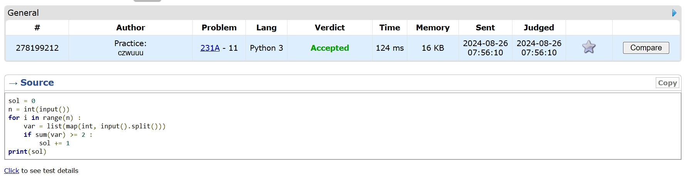

# Assignment #1

2024 fall, Complied by ==吴诚舟·物理学院==

## 1. 题目

### 02733: 判断闰年

http://cs101.openjudge.cn/practice/02733/

##### 代码

```python
year = int(input())
result = "N"
if year%4 == 0 :
    result = "Y"
if year%100 == 0 and year%400 != 0 :
    result = "N"
if year%3200 == 0 :
    result = "N"
print(result)

```


代码运行截图 ==（至少包含有"Accepted"）==


### 02750: 鸡兔同笼

http://cs101.openjudge.cn/practice/02750/

##### 代码

```python
foot = int(input())
if foot%2 == 0 :
    max = foot/2
    if foot%4 == 0 :
        min = foot/4
    else :
        min = (foot/2+1)/2
    min = int(min)
    max = int(max)
    print(min, max)
else :
    print(0, 0)


```


代码运行截图 ==（至少包含有"Accepted"）==


### 50A. Domino piling

greedy, math, 800, http://codeforces.com/problemset/problem/50/A

##### 代码

```python
M, N = map(int, input().split())
result = 0
if M == 1 :
    result = N//2
elif M >= 2 :
    if M%2 == 0:
        result = M*N/2
    else :
        result = (M-1)*N/2 + N//2
print(int(result))

```


代码运行截图 ==（AC代码截图，至少包含有"Accepted"）==


### 1A. Theatre Square

math, 1000, https://codeforces.com/problemset/problem/1/A

##### 代码

```python
from math import ceil
n, m, a = map(int, input().split())
result = ceil(n/a)*ceil(m/a)
print(int(result))


```


代码运行截图 ==（AC代码截图，至少包含有"Accepted"）==


### 112A. Petya and Strings

implementation, strings, 1000, http://codeforces.com/problemset/problem/112/A

##### 代码

```python
a = input()
b = input()
a = a.lower()
b = b.lower()
if a < b :
    print(-1)
elif a == b :
    print(0)
else :
    print(1)


```


代码运行截图 ==（AC代码截图，至少包含有"Accepted"）==


### 231A. Team

bruteforce, greedy, 800, http://codeforces.com/problemset/problem/231/A

##### 代码

```python
sol = 0
n = int(input())
for i in range(n) :
    var = list(map(int, input().split()))
    if sum(var) >= 2 :
        sol += 1
print(sol)

```


代码运行截图 ==（AC代码截图，至少包含有"Accepted"）==




## 2. 学习总结和收获

9.19:之前的每日选做（除中秋）全部完成

题目比较简单


