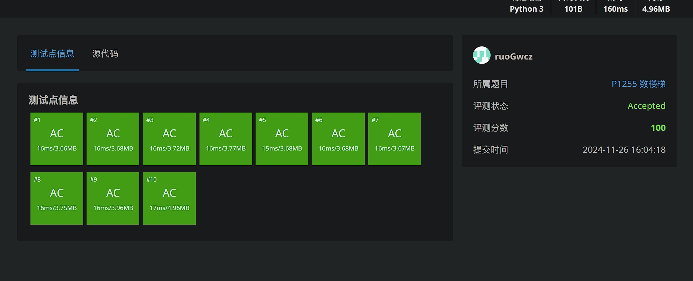
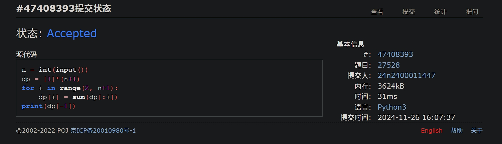
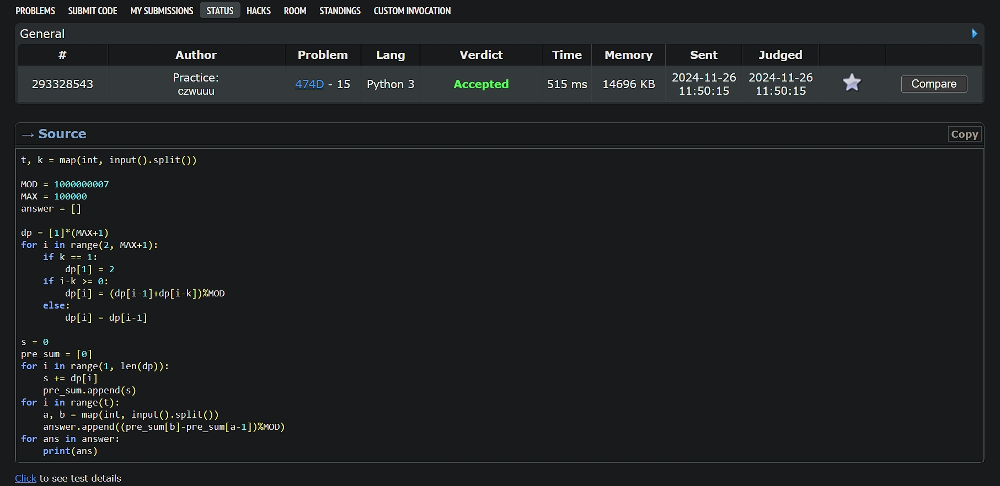
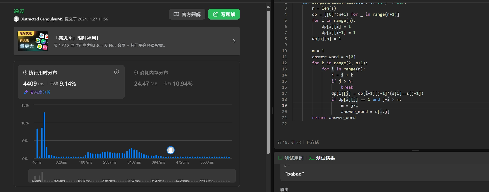
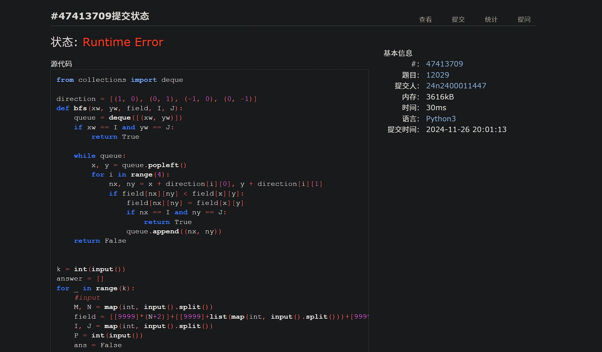
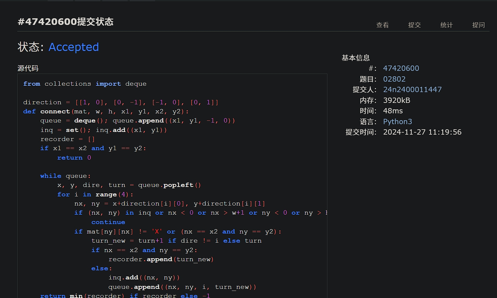

# Assignment #10: dp & bfs

Updated 2 GMT+8 Nov 25, 2024

2024 fall, Complied by <mark>吴诚舟---物理学院</mark>


**说明：**

1）请把每个题目解题思路（可选），源码Python, 或者C++（已经在Codeforces/Openjudge上AC），截图（包含Accepted），填写到下面作业模版中（推荐使用 typora https://typoraio.cn ，或者用word）。AC 或者没有AC，都请标上每个题目大致花费时间。

2）提交时候先提交pdf文件，再把md或者doc文件上传到右侧“作业评论”。Canvas需要有同学清晰头像、提交文件有pdf、"作业评论"区有上传的md或者doc附件。

3）如果不能在截止前提交作业，请写明原因。


## 1. 题目

### LuoguP1255 数楼梯

dp, bfs, https://www.luogu.com.cn/problem/P1255

代码：

```python
n = int(input())
dp = [1]*(n+1)
for i in range(2, n+1):
    dp[i] = dp[i-1]+dp[i-2]
print(dp[-1])
```


代码运行截图 <mark>（至少包含有"Accepted"）</mark>




### 27528: 跳台阶

dp, http://cs101.openjudge.cn/practice/27528/

代码：

```python
n = int(input())
dp = [1]*(n+1)
for i in range(2, n+1):
    dp[i] = sum(dp[:i])
print(dp[-1])
```


代码运行截图 ==（至少包含有"Accepted"）==




### 474D. Flowers

dp, https://codeforces.com/problemset/problem/474/D

代码：

```python
t, k = map(int, input().split())

MOD = 1000000007
MAX = 100000
answer = []

dp = [1]*(MAX+1)
for i in range(2, MAX+1):
    if k == 1:
        dp[1] = 2
    if i-k >= 0:
        dp[i] = (dp[i-1]+dp[i-k])%MOD
    else:
        dp[i] = dp[i-1]

s = 0
pre_sum = [0]
for i in range(1, len(dp)):
    s += dp[i]
    pre_sum.append(s)
for i in range(t):
    a, b = map(int, input().split())
    answer.append((pre_sum[b]-pre_sum[a-1])%MOD)
for ans in answer:
    print(ans)
```


代码运行截图 <mark>（至少包含有"Accepted"）</mark>




### LeetCode5.最长回文子串

dp, two pointers, string, https://leetcode.cn/problems/longest-palindromic-substring/

代码：

```python
class Solution:
    def longestPalindrome(self, s: str) -> str:
        n = len(s)
        dp = [[0]*(n+1) for _ in range(n+1)]
        for i in range(n):
            dp[i][i] = 1
            dp[i][i+1] = 1
        dp[n][n] = 1

        m = 1
        answer_word = s[0]
        for k in range(2, n+1):
            for i in range(n):
                j = i + k
                if j > n:
                    break
                dp[i][j] = dp[i+1][j-1]*(s[i]==s[j-1])
                if dp[i][j] == 1 and j-i > m:
                    m = j-i
                    answer_word = s[i:j]
        return answer_word
```


代码运行截图 <mark>（至少包含有"Accepted"）</mark>




### 12029: 水淹七军

bfs, dfs, http://cs101.openjudge.cn/practice/12029/

搞了2h发现是输入问题...

代码：

```python
from collections import deque

direction = [(1, 0), (0, 1), (-1, 0), (0, -1)]
def bfs(xw, yw, field, I, J):
    queue = deque(); queue.append((xw, yw))
    if xw == I and yw == J:
        return True

    while queue:
        x, y = queue.popleft()
        for i in range(4):
            nx, ny = x + direction[i][0], y + direction[i][1]
            if field[nx][ny] < field[x][y]:
                field[nx][ny] = field[x][y]
                if nx == I and ny == J:
                    return True
                queue.append((nx, ny))
    return False


k = int(input())
answer = []
for _ in range(k):
    #input
    M, N = map(int, input().split())
    field = [[99999]*(N+2)]+[[99999]+list(map(int, input().split()))+[99999] for _ in range(M)]+[[99999]*(N+2)]
    I, J = map(int, input().split())
    P = int(input())
    ans = False

    #process
    for _ in range(P):
        xw, yw = map(int, input().split())
        ans = bfs(xw, yw, field, I, J)
        if ans:
            break
    answer.append(ans)

for a in answer:
    print('Yes' if a else 'No')
```


代码运行截图 <mark>（至少包含有"Accepted"）</mark>



**不想改输入输出了（怒**，我确定自己是对的


### 02802: 小游戏

bfs, http://cs101.openjudge.cn/practice/02802/

代码：

```python
from collections import deque

direction = [[1, 0], [0, -1], [-1, 0], [0, 1]]
def connect(mat, w, h, x1, y1, x2, y2):
    queue = deque(); queue.append((x1, y1, -1, 0))
    inq = set(); inq.add((x1, y1))
    recorder = []
    if x1 == x2 and y1 == y2:
        return 0

    while queue:
        x, y, dire, turn = queue.popleft()
        for i in range(4):
            nx, ny = x+direction[i][0], y+direction[i][1]
            if (nx, ny) in inq or nx < 0 or nx > w+1 or ny < 0 or ny > h+1:
                continue
            if mat[ny][nx] != 'X' or (nx == x2 and ny == y2):
                turn_new = turn+1 if dire != i else turn
                if nx == x2 and ny == y2:
                    recorder.append(turn_new)
                else:
                    inq.add((nx, ny))
                    queue.append((nx, ny, i, turn_new))
    return min(recorder) if recorder else -1

#输入和答案的存储
n = 0
answer = []
while True:
    n += 1
    w, h = map(int, input().split())
    mat = [[" "]*(w+2)]
    if w == 0 and h == 0:
        break
    else:
        for i in range(h):
            line = [" "]+list(input())+[" "]
            mat.append(line)
        mat.append([" "]*(w+2))

        m = 0
        _answer_ = []
        while True:
            m += 1
            x1, y1, x2, y2 = map(int, input().split())
            if x1 == 0 and x2 == 0 and y1 == 0 and y2 == 0:
                break
            else:
                _answer_.append(connect(mat, w, h, x1, y1, x2, y2))
        answer.append(_answer_)

#输出模块
for i in range(1, n):
    print(f"Board #{i}:")
    for j in range(1, len(answer[i-1])+1):
        if answer[i-1][j-1] == -1:
            ans_word = "impossible."
        else:
            ans_word = str(answer[i-1][j-1])+" segments."
        print(f"Pair {j}: {ans_word}")
    print('')
```


代码运行截图 <mark>（至少包含有"Accepted"）</mark>




## 2. 学习总结和收获

<mark>如果作业题目简单，有否额外练习题目，比如：OJ“计概2024fall每日选做”、CF、LeetCode、洛谷等网站题目。</mark>

前两道题十分简单。最后两道bfs花了很长时间调试，其中水淹七军居然是测试数据有问题，破大防。

最近每日选做有点落下了。


