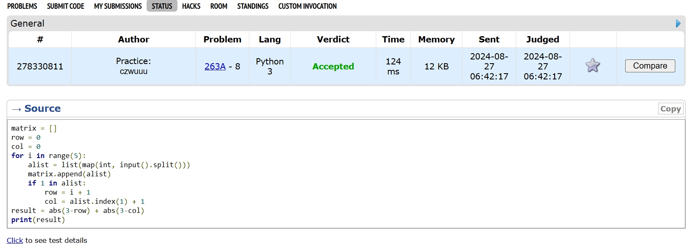
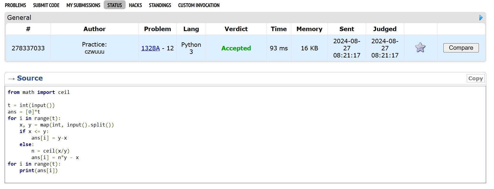
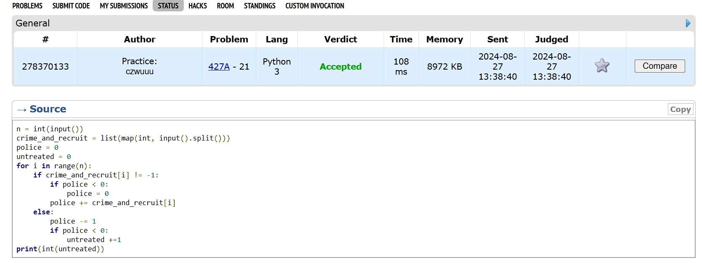
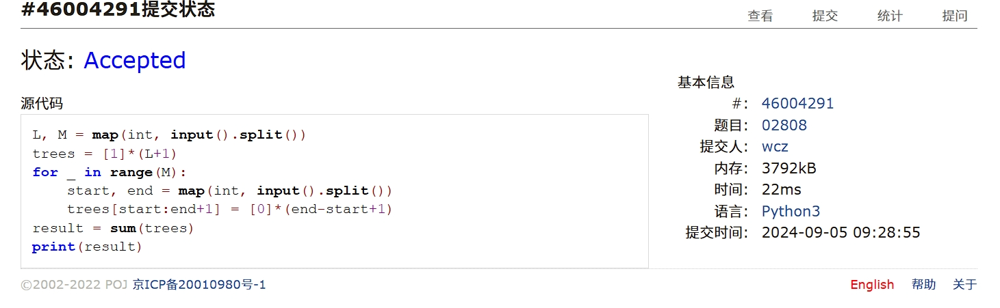
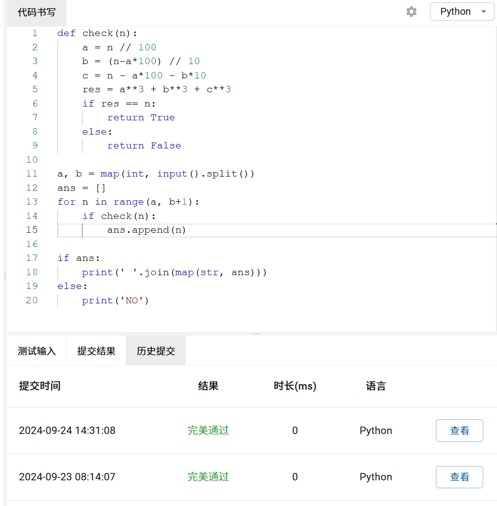
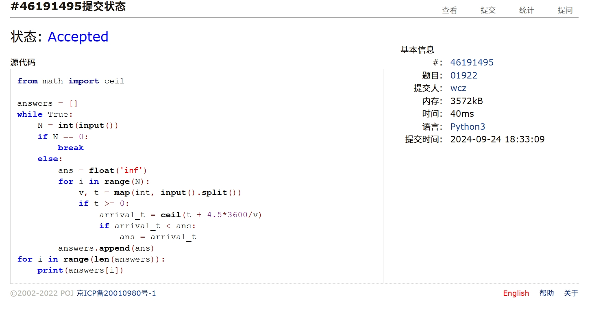

# Assignment #2: 语法练习

2024 fall, Complied by ==物理学院24本吴诚舟==

## 1. 题目

### 263A. Beautiful Matrix

https://codeforces.com/problemset/problem/263/A

##### 代码

```python
matrix = []
row = 0
col = 0
for i in range(5):
    alist = list(map(int, input().split()))
    matrix.append(alist)
    if 1 in alist:
        row = i + 1
        col = alist.index(1) + 1
result = abs(3-row) + abs(3-col)
print(result)

```


代码运行截图 ==（至少包含有"Accepted"）==




### 1328A. Divisibility Problem

https://codeforces.com/problemset/problem/1328/A

##### 代码

```python
from math import ceil

t = int(input())
ans = [0]*t
for i in range(t):
    x, y = map(int, input().split())
    if x <= y:
        ans[i] = y-x
    else:
        n = ceil(x/y)
        ans[i] = n*y - x
for i in range(t):
    print(ans[i])
 

```


代码运行截图 ==（至少包含有"Accepted"）==




### 427A. Police Recruits

https://codeforces.com/problemset/problem/427/A

##### 代码

```python
n = int(input())
crime_and_recruit = list(map(int, input().split()))
police = 0
untreated = 0
for i in range(n):
    if crime_and_recruit[i] != -1:
        if police < 0:
            police = 0
        police += crime_and_recruit[i]
    else:
        police -= 1
        if police < 0:
            untreated +=1
print(int(untreated))
```


代码运行截图 ==（AC代码截图，至少包含有"Accepted"）==




### 02808: 校门外的树

http://cs101.openjudge.cn/practice/02808/

##### 代码

```python
L, M = map(int, input().split())
trees = [1]*(L+1)
for _ in range(M):
    start, end = map(int, input().split())
    trees[start:end+1] = [0]*(end-start+1)
result = sum(trees)
print(result)
```


代码运行截图 ==（AC代码截图，至少包含有"Accepted"）==




### sy60: 水仙花数II

https://sunnywhy.com/sfbj/3/1/60

##### 代码

```python
def check(n):
    a = n // 100
    b = (n-a*100) // 10
    c = n - a*100 - b*10
    res = a**3 + b**3 + c**3
    if res == n:
        return True
    else:
        return False

a, b = map(int, input().split())
ans = []
for n in range(a, b+1):
    if check(n):
        ans.append(n)

if ans:
    print(' '.join(map(str, ans)))
else:
    print('NO')
```


代码运行截图 ==（AC代码截图，至少包含有"Accepted"）==




### 01922: Ride to School

http://cs101.openjudge.cn/practice/01922/

##### 代码

```python
from math import ceil

answers = []
while True:
    N = int(input())
    if N == 0:
        break
    else:
        ans = float('inf')
        for i in range(N):
            v, t = map(int, input().split())
            if t >= 0:
                arrival_t = ceil(t + 4.5*3600/v)
                if arrival_t < ans:
                    ans = arrival_t
        answers.append(ans)
for i in range(len(answers)):
    print(answers[i])
```


代码运行截图 ==（AC代码截图，至少包含有"Accepted"）==




## 2. 学习总结和收获

普遍比较简单。但是最后一道题有收获。一个是知道了无穷大的表示方法。还有其实一开始没想出怎么做（没想到只要比较每个rider到达时间就行），后来看了课程群里同学的代码才恍然大悟。

每日选做在跟进（p.s. 难度E是Easy吗（doge


