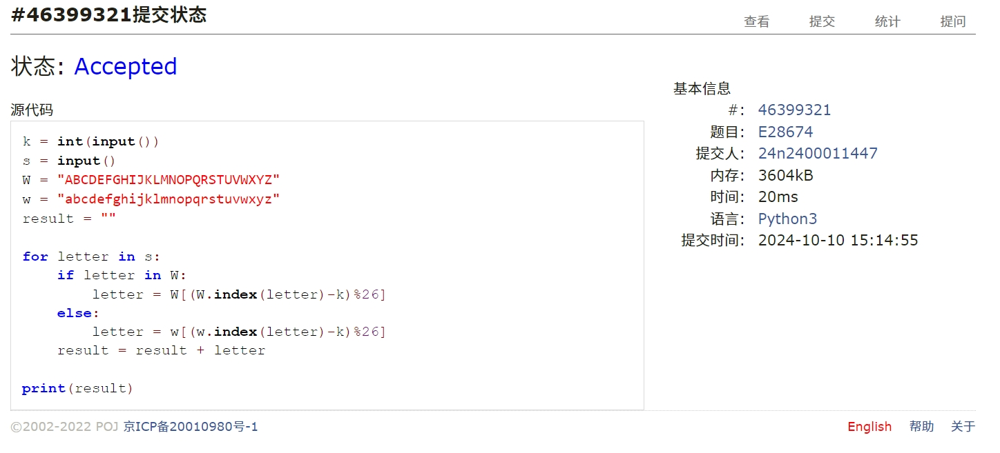
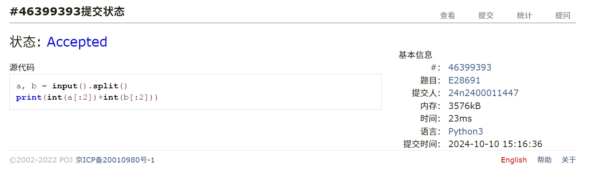
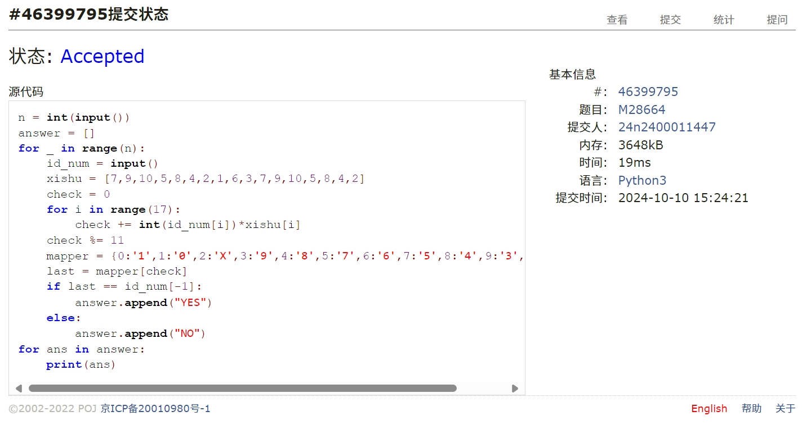
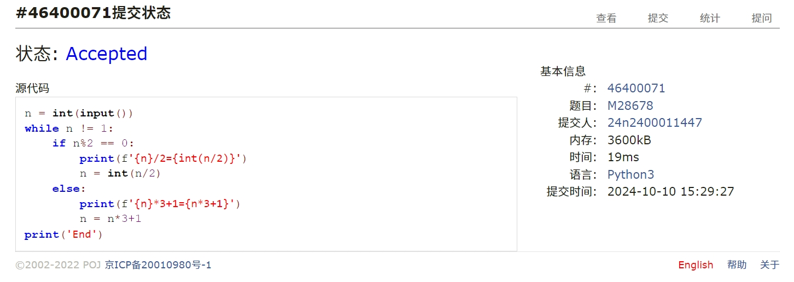
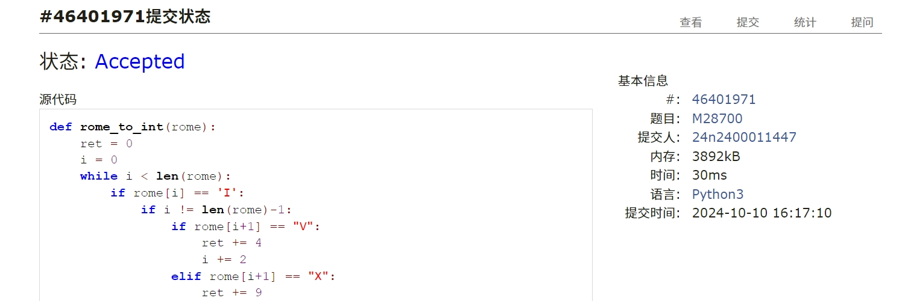
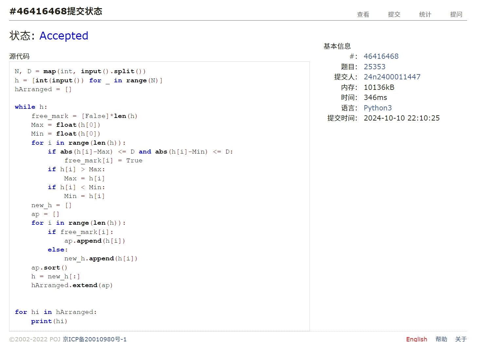

# Assign #3: Oct Mock Exam暨选做题目满百

2024 fall, Complied by ==物理学院吴诚舟==


**说明：**

1）Oct⽉考： AC5。考试题⽬都在“题库（包括计概、数算题目）”⾥⾯，按照数字题号能找到，可以重新提交。作业中提交⾃⼰最满意版本的代码和截图。

2）请把每个题目解题思路（可选），源码Python, 或者C++/C（已经在Codeforces/Openjudge上AC），截图（包含Accepted, 学号），填写到下面作业模版中（推荐使用 typora https://typoraio.cn ，或者用word）。AC 或者没有AC，都请标上每个题目大致花费时间。

3）提交时候先提交pdf文件，再把md或者doc文件上传到右侧“作业评论”。Canvas需要有同学清晰头像、提交文件有pdf、作业评论有md或者doc。

4）如果不能在截止前提交作业，请写明原因。


## 1. 题目

### E28674:《黑神话：悟空》之加密

http://cs101.openjudge.cn/practice/28674/

代码

```python
k = int(input())
s = input()
W = "ABCDEFGHIJKLMNOPQRSTUVWXYZ"
w = "abcdefghijklmnopqrstuvwxyz"
result = ""

for letter in s:
    if letter in W:
        letter = W[(W.index(letter)-k)%26]
    else:
        letter = w[(w.index(letter)-k)%26]
    result = result + letter

print(result)
```


代码运行截图 ==（至少包含有"Accepted"）==




### E28691: 字符串中的整数求和

http://cs101.openjudge.cn/practice/28691/

代码

```python
a, b = input().split()
print(int(a[:2])+int(b[:2]))
```


代码运行截图 ==（至少包含有"Accepted"）==




### M28664: 验证身份证号

http://cs101.openjudge.cn/practice/28664/

代码

```python
n = int(input())
answer = []
for _ in range(n):
    id_num = input()
    xishu = [7,9,10,5,8,4,2,1,6,3,7,9,10,5,8,4,2]
    check = 0
    for i in range(17):
        check += int(id_num[i])*xishu[i]
    check %= 11
    mapper = {0:'1',1:'0',2:'X',3:'9',4:'8',5:'7',6:'6',7:'5',8:'4',9:'3',10:'2'}
    last = mapper[check]
    if last == id_num[-1]:
        answer.append("YES")
    else:
        answer.append("NO")
for ans in answer:
    print(ans)
```


代码运行截图 ==（AC代码截图，至少包含有"Accepted"）==




### M28678: 角谷猜想

http://cs101.openjudge.cn/practice/28678/

代码

```python
n = int(input())
while n != 1:
    if n%2 == 0:
        print(f'{n}/2={int(n/2)}')
        n = int(n/2)
    else:
        print(f'{n}*3+1={n*3+1}')
        n = n*3+1
print('End')
```


代码运行截图 ==（AC代码截图，至少包含有"Accepted"）==




### M28700: 罗马数字与整数的转换

http://cs101.openjudge.cn/practice/28700/

##### 代码

```python
def rome_to_int(rome):
    ret = 0
    i = 0
    while i < len(rome):
        if rome[i] == 'I':
            if i != len(rome)-1:
                if rome[i+1] == "V":
                    ret += 4
                    i += 2
                elif rome[i+1] == "X":
                    ret += 9
                    i += 2
                else:
                    ret += 1
                    i += 1
            else:
                ret += 1
                i += 1
        elif rome[i] == "V":
            ret += 5
            i += 1
        elif rome[i] == "X":
            if i != len(rome) - 1:
                if rome[i+1] == "L":
                    ret += 40
                    i += 2
                elif rome[i+1] == "C":
                    ret += 90
                    i += 2
                else:
                    ret += 10
                    i += 1
            else:
                ret += 10
                i += 1
        elif rome[i] == "L":
            ret += 50
            i += 1
        elif rome[i] == "C":
            if i != len(rome) - 1:
                if rome[i+1] == "D":
                    ret += 400
                    i += 2
                elif rome[i+1] == "M":
                    ret += 900
                    i += 2
                else:
                    ret += 100
                    i += 1
            else:
                ret += 100
                i += 1
        elif rome[i] == 'D':
            ret += 500
            i += 1
        else:
            ret += 1000
            i += 1
    return ret


def int_to_rome(n):
    ret = ''
    n = int(n)

    ret = ret + 'M'*(n//1000)
    n = n % 1000

    if len(str(n)) == 3:
        if str(n)[0] == '9':
            ret += 'CM'
            n = int(str(n)[1:])
        elif str(n)[0] == '4':
            ret += 'CD'
            n = int(str(n)[1:])
        elif str(n)[0] >= '5':
            ret += 'D'
            n -= 500

    if len(str(n)) == 3:
        ret += 'C'*int(str(n)[0])
        n = int(str(n)[1:])

    if len(str(n)) == 2:
        if str(n)[0] == '9':
            ret += 'XC'
            n = int(str(n)[1:])
        elif str(n)[0] == '4':
            ret += 'XL'
            n = int(str(n)[1:])
        elif str(n)[0] >= '5':
            ret += 'L'
            n -= 50

    if len(str(n)) == 2:
        ret += 'X'*int(str(n)[0])
        n = int(str(n)[1:])

    if len(str(n)) == 1 and n > 0:
        if n == 9:
            ret += 'IX'
            n = 0
        elif n == 4:
            ret += 'IV'
            n = 0
        elif n >= 5:
            ret += 'V'
            n -= 5

    if len(str(n)) == 1 and n > 0:
        ret += 'I'*n
        n = 0

    return ret


number = input()
if '0' <= number[0] <= '9':
    print(int_to_rome(number))
else:
    print(rome_to_int(number))
```


代码运行截图 ==（AC代码截图，至少包含有"Accepted"）==




### *T25353: 排队 （选做）

http://cs101.openjudge.cn/practice/25353/


思路：（瞄了一眼gsy学长的题解有的思路）把一类数称作自由节点，如果它能和其之前的任意数字对换。贪心策略---把所有自由节点放在前面，排序|不断对剩下的元素循环操作，直至所有数字排完。正确性的证明---因为某一次循环中，自由节点最大的数M和最小的数m之差M-m不大于D，所以其他非自由节点必然大于M或者小于m，否则就是自由的；若大于M，则在最小字典序序列中必然位于 本次取出的自由节点列之后，若小于m，则一定不能越过M，故换不到前面去。(描述比较抽象)


代码

```python
N, D = map(int, input().split())
h = [int(input()) for _ in range(N)]
hArranged = []

while h:
    free_mark = [False]*len(h)
    Max = float(h[0])
    Min = float(h[0])
    for i in range(len(h)):
        if abs(h[i]-Max) <= D and abs(h[i]-Min) <= D:
            free_mark[i] = True
        if h[i] > Max:
            Max = h[i]
        if h[i] < Min:
            Min = h[i]
    new_h = []
    ap = []
    for i in range(len(h)):
        if free_mark[i]:
            ap.append(h[i])
        else:
            new_h.append(h[i])
    ap.sort()
    h = new_h[:]
    hArranged.extend(ap)


for hi in hArranged:
    print(hi)
```


代码运行截图 ==（AC代码截图，至少包含有"Accepted"）==




## 2. 学习总结和收获

1.每日选做：在跟进中。感觉国庆节开始难度有明显提升。一开始不太适应，有些题目想了一两个小时，最后求助gpt才做出来。但感觉很有收获。学到了一些用空间换时间的方法。有印象的比如，求一串列表任意连续子列的和，可以维护一个a[1]+...+a[i]的列表；还有埃氏筛（虽然欧拉筛仍然需要在gpt帮助下写出，而且不太理解原理，但埃氏筛已经很熟练了）。很享受一次次降低算法复杂度的过程。在gpt帮助下也学会了一些元组，集合，字典的使用技巧。尤其是字典，在统计列表中元素频率方面很有用。

2.月考：AC5。前4道题切菜。第五道罗马数字，没有想到字典，写了一堆if-else，虽然代码较长，但逻辑还比较清晰，后面很多是复制粘贴更改的，没有看花了多久，大概给最后一题留了50min。最后一题实际上花了30min才反应过来字典序是什么，最后没想出贪心策略。


