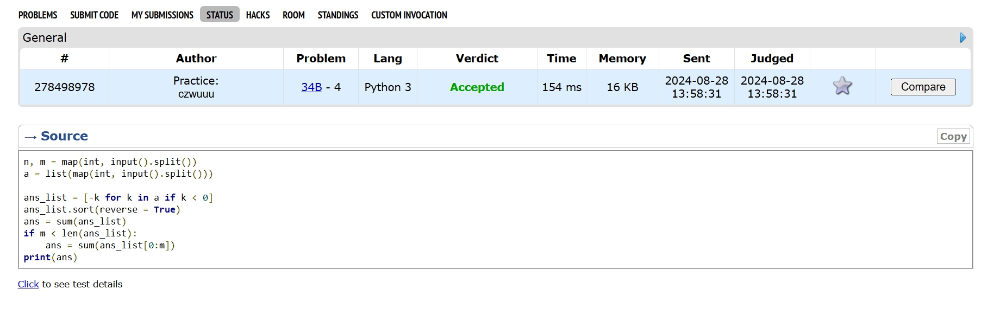
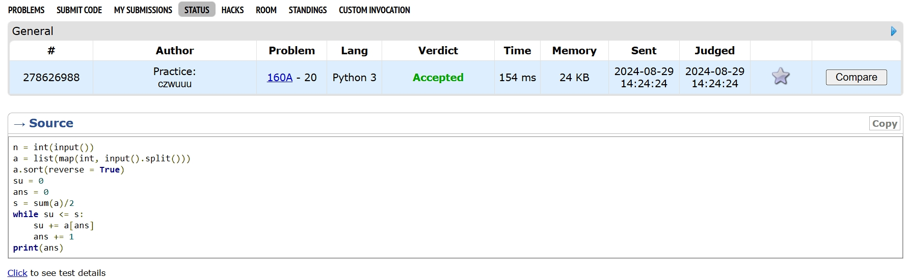
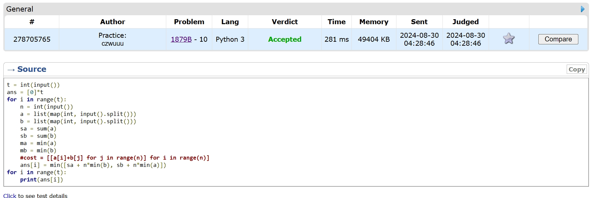
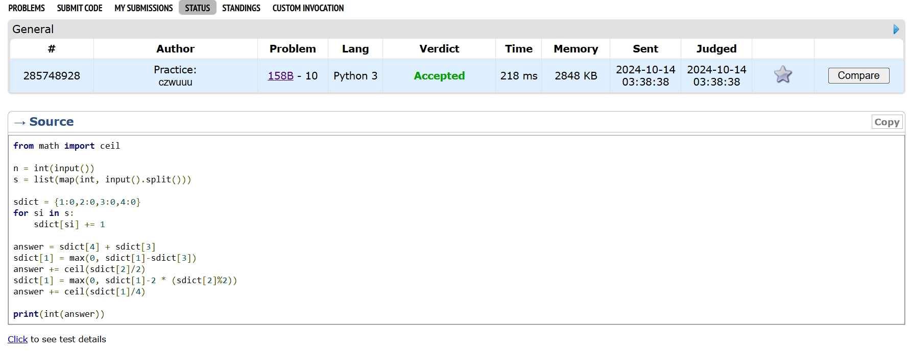
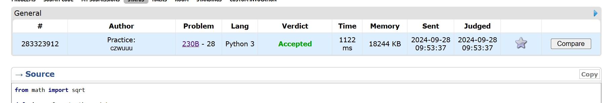
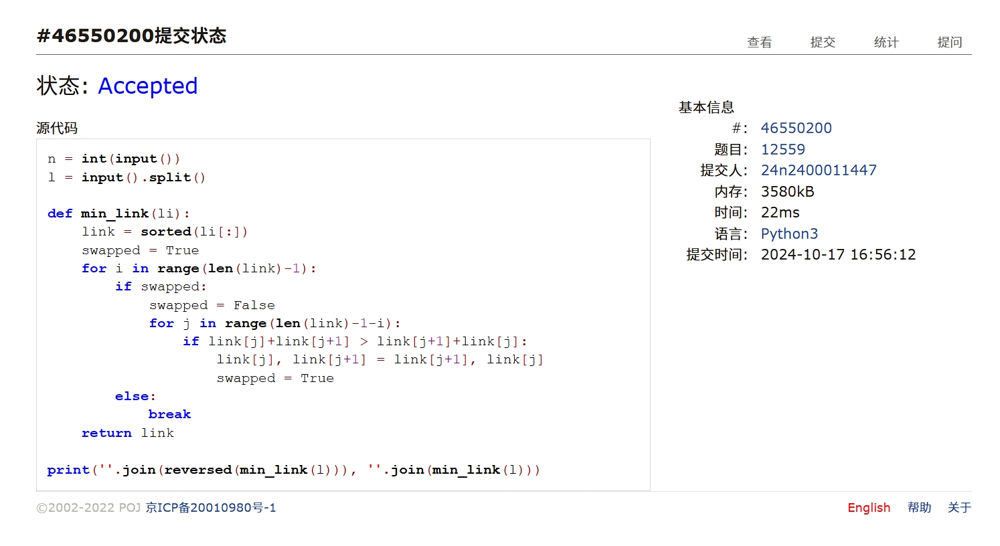

# Assignment #4: T-primes + 贪心

2024 fall, Complied by <mark>吴诚舟-物理学院</mark>


## 1. 题目

### 34B. Sale

greedy, sorting, 900, https://codeforces.com/problemset/problem/34/B

代码

```python
n, m = map(int, input().split())
a = list(map(int, input().split()))

ans_list = [-k for k in a if k < 0]
ans_list.sort(reverse = True)
ans = sum(ans_list)
if m < len(ans_list):
    ans = sum(ans_list[0:m])
print(ans)
```


代码运行截图 <mark>（至少包含有"Accepted"）</mark>




### 160A. Twins

greedy, sortings, 900, https://codeforces.com/problemset/problem/160/A

代码

```python
n = int(input())
a = list(map(int, input().split()))
a.sort(reverse = True)
su = 0
ans = 0
s = sum(a)/2
while su <= s:
    su += a[ans]
    ans += 1
print(ans)
```


代码运行截图 ==（至少包含有"Accepted"）==




### 1879B. Chips on the Board

constructive algorithms, greedy, 900, https://codeforces.com/problemset/problem/1879/B

代码

```python
t = int(input())
ans = [0]*t
for i in range(t):
    n = int(input())
    a = list(map(int, input().split()))
    b = list(map(int, input().split()))
    sa = sum(a)
    sb = sum(b)
    ma = min(a)
    mb = min(b)
    #cost = [[a[i]+b[j] for j in range(n)] for i in range(n)]
    ans[i] = min([sa + n*min(b), sb + n*min(a)])
for i in range(t):
    print(ans[i])
```


代码运行截图 <mark>（至少包含有"Accepted"）</mark>




### 158B. Taxi

*special problem, greedy, implementation, 1100, https://codeforces.com/problemset/problem/158/B

代码

```python
from math import ceil

n = int(input())
s = list(map(int, input().split()))

sdict = {1:0,2:0,3:0,4:0}
for si in s:
    sdict[si] += 1

answer = sdict[4] + sdict[3]
sdict[1] = max(0, sdict[1]-sdict[3])
answer += ceil(sdict[2]/2)
sdict[1] = max(0, sdict[1]-2 * (sdict[2]%2))
answer += ceil(sdict[1]/4)

print(int(answer))
```


代码运行截图 <mark>（至少包含有"Accepted"）</mark>




### *230B. T-primes（选做）

binary search, implementation, math, number theory, 1300, http://codeforces.com/problemset/problem/230/B

代码

```python
from math import sqrt

def sieve_of_eratosthenes(n):
    is_prime = [True for i in range(n+1)]
    is_prime[0] = False
    is_prime[1] = False

    for i in range(2, int(sqrt(n))+1):
        if is_prime[i]:
            for j in range(i**2, n+1, i):
                is_prime[j] = False

    primes = [i for i in range(2, n+1) if is_prime[i]]
    return set(primes)

primes = sieve_of_eratosthenes(1000000)

def check_tprime(t):
    s = sqrt(t)
    if s == int(s):
        if s in primes:
            return True
        else:
            return False
    else:
        return False

n = int(input())
x = list(map(int, input().split()))
ans = []
for i in range(n):
    if check_tprime(x[i]):
        ans.append("YES")
    else:
        ans.append("NO")

for item in ans:
    print(item)
```


代码运行截图 <mark>（至少包含有"Accepted"）</mark>




### *12559: 最大最小整数 （选做）

greedy, strings, sortings, http://cs101.openjudge.cn/practice/12559

代码

```python
n = int(input())
l = input().split()

def min_link(li):
    link = sorted(li[:])
    swapped = True
    for i in range(len(link)-1):
        if swapped:
            swapped = False
            for j in range(len(link)-1-i):
                if link[j]+link[j+1] > link[j+1]+link[j]:
                    link[j], link[j+1] = link[j+1], link[j]
                    swapped = True
        else:
            break
    return link

print(''.join(reversed(min_link(l))), ''.join(min_link(l)))
```


代码运行截图 <mark>（至少包含有"Accepted"）</mark>




## 2. 学习总结和收获

每日选做每天做。这两天试图消化课件上有挑战性的内容，学到了一些有用的python技巧、数据结构和算法。为了看懂 **排队又来了** ，尝试学了树的基本概念，发现堆可以用树来实现于是学了一下二叉堆，照着 **python数据结构与算法** 那本书手搓了一个BinaryTree和BinaryHeap，最后伤心地发现python自带的heapq要好用得多（不过没做过相关题目，所以不知道这些DS具体怎么用）。那个 O(n logn) 的算法还是没看懂，希望下次上课之前可以消化掉。

作业最后一题刚开始没想出来。后来瞄了一眼课件发现可以用冒泡排序。由于不知道冒泡排序是啥，于是学了一下。打算顺便把十大排序都学了，目前学了前四个（bubble, selection, insertion, shell)，知道了排序稳定性的概念，同时了解到python中的sort用的是Timsort算法，比这些要快得多，而且还是稳定的，于是又伤心了一小会。学完之后回来看 **最大最小整数** 发现用bubble_sort秒了，不过速度较慢。于是结合了一下python内置的sort和优化后的bubble_sort，成功提升到22ms，在测试数据范围内的表现 和课件中直接sort的n logn算法一样好！开心。

发现课件中能深挖的地方还很多。如果每处都仔仔细细学，确实会很大程度上减小下学期工作量（虽然这学期会很累）。希望能在下次上课前把 **排队又来了** , 十大排序算法，正则表达式学会。一些经典的算法和数据结构虽然可能不会直接用（python内置函数和标准库太nb），但掌握基本思想还是有益的（见 **最大最小整数**)。

