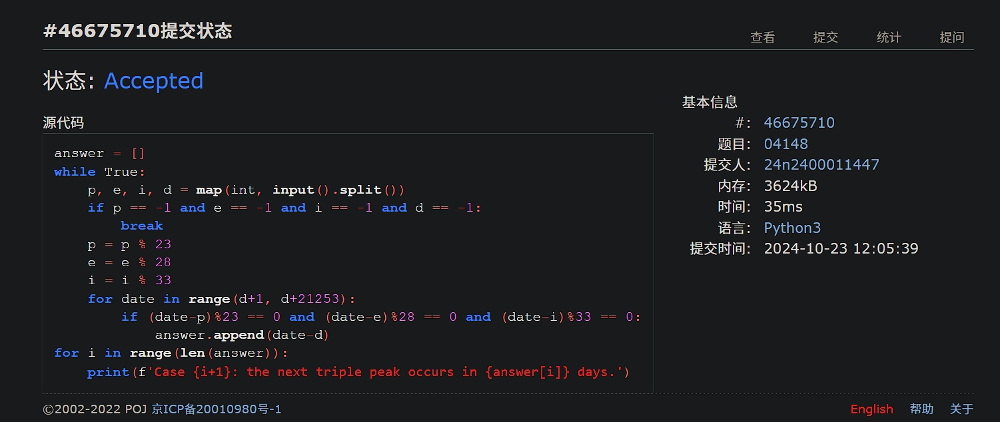
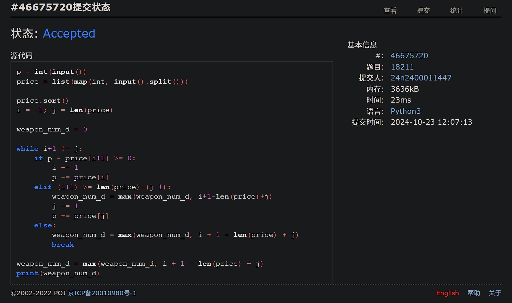
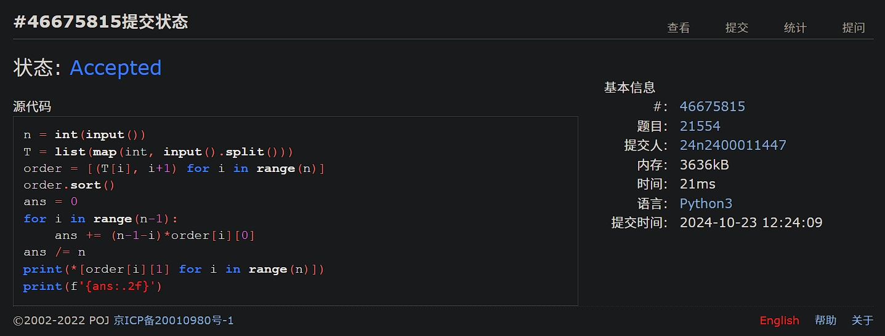
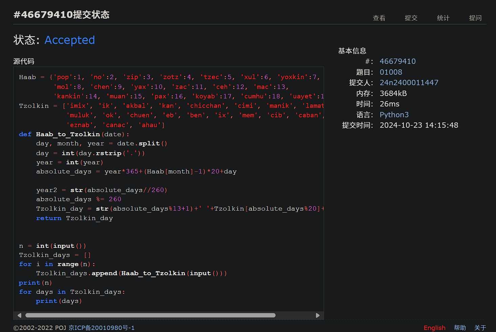
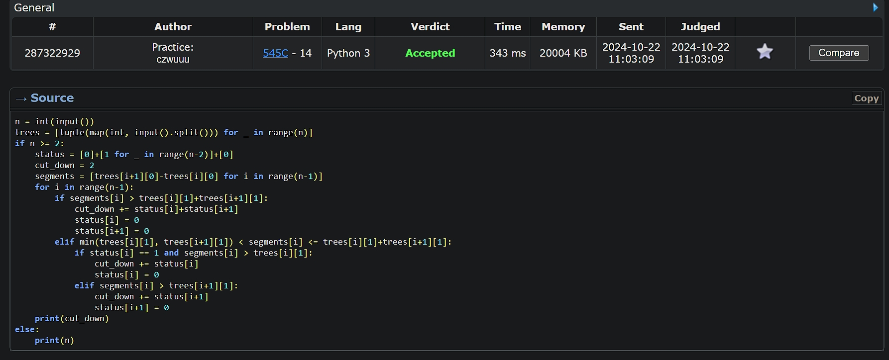
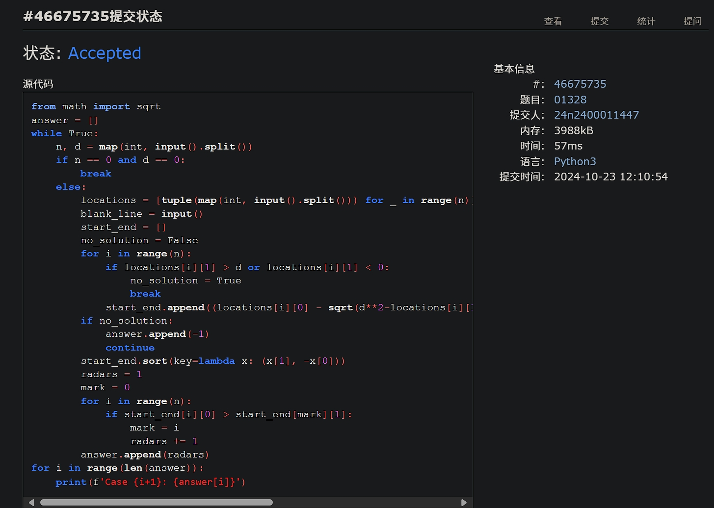

# Assignment #5: Greedy穷举Implementation

2024 fall, Complied by <mark>物理学院吴诚舟</mark>


## 1. 题目

### 04148: 生理周期

brute force, http://cs101.openjudge.cn/practice/04148

代码：

```python
answer = []
while True:
    p, e, i, d = map(int, input().split())
    if p == -1 and e == -1 and i == -1 and d == -1:
        break
    p = p % 23
    e = e % 28
    i = i % 33
    for date in range(d+1, d+21253):
        if (date-p)%23 == 0 and (date-e)%28 == 0 and (date-i)%33 == 0:
            answer.append(date-d)
for i in range(len(answer)):
    print(f'Case {i+1}: the next triple peak occurs in {answer[i]} days.')
```


代码运行截图 <mark>（至少包含有"Accepted"）</mark>




### 18211: 军备竞赛

greedy, two pointers, http://cs101.openjudge.cn/practice/18211

代码：

```python
p = int(input())
price = list(map(int, input().split()))

price.sort()
i = -1; j = len(price)

weapon_num_d = 0

while i+1 != j:
    if p - price[i+1] >= 0:
        i += 1
        p -= price[i]
    elif (i+1) >= len(price)-(j-1):
        weapon_num_d = max(weapon_num_d, i+1-len(price)+j)
        j -= 1
        p += price[j]
    else:
        weapon_num_d = max(weapon_num_d, i + 1 - len(price) + j)
        break

weapon_num_d = max(weapon_num_d, i + 1 - len(price) + j)
print(weapon_num_d)
```


代码运行截图 ==（至少包含有"Accepted"）==




### 21554: 排队做实验

greedy, http://cs101.openjudge.cn/practice/21554

代码：

```python
n = int(input())
T = list(map(int, input().split()))
order = [(T[i], i+1) for i in range(n)]
order.sort()
ans = 0
for i in range(n-1):
    ans += (n-1-i)*order[i][0]
ans /= n
print(*[order[i][1] for i in range(n)])
print(f'{ans:.2f}')
```


代码运行截图 <mark>（至少包含有"Accepted"）</mark>




### 01008: Maya Calendar

implementation, http://cs101.openjudge.cn/practice/01008/

代码：

```python
Haab = {'pop':1, 'no':2, 'zip':3, 'zotz':4, 'tzec':5, 'xul':6, 'yoxkin':7,
        'mol':8, 'chen':9, 'yax':10, 'zac':11, 'ceh':12, 'mac':13,
        'kankin':14, 'muan':15, 'pax':16, 'koyab':17, 'cumhu':18, 'uayet':19}
Tzolkin = ['imix', 'ik', 'akbal', 'kan', 'chicchan', 'cimi', 'manik', 'lamat',
           'muluk', 'ok', 'chuen', 'eb', 'ben', 'ix', 'mem', 'cib', 'caban',
           'eznab', 'canac', 'ahau']
def Haab_to_Tzolkin(date):
    day, month, year = date.split()
    day = int(day.rstrip('.'))
    year = int(year)
    absolute_days = year*365+(Haab[month]-1)*20+day

    year2 = str(absolute_days//260)
    absolute_days %= 260
    Tzolkin_day = str(absolute_days%13+1)+' '+Tzolkin[absolute_days%20]+' '+year2
    return Tzolkin_day


n = int(input())
Tzolkin_days = []
for i in range(n):
    Tzolkin_days.append(Haab_to_Tzolkin(input()))
print(n)
for days in Tzolkin_days:
    print(days)

```


代码运行截图 <mark>（至少包含有"Accepted"）</mark>




### 545C. Woodcutters

dp, greedy, 1500, https://codeforces.com/problemset/problem/545/C

代码：

```python
n = int(input())
trees = [tuple(map(int, input().split())) for _ in range(n)]
if n >= 2:
    status = [0]+[1 for _ in range(n-2)]+[0]
    cut_down = 2
    segments = [trees[i+1][0]-trees[i][0] for i in range(n-1)]
    for i in range(n-1):
        if segments[i] > trees[i][1]+trees[i+1][1]:
            cut_down += status[i]+status[i+1]
            status[i] = 0
            status[i+1] = 0
        elif min(trees[i][1], trees[i+1][1]) < segments[i] <= trees[i][1]+trees[i+1][1]:
            if status[i] == 1 and segments[i] > trees[i][1]:
                cut_down += status[i]
                status[i] = 0
            elif segments[i] > trees[i+1][1]:
                cut_down += status[i+1]
                status[i+1] = 0
    print(cut_down)
else:
    print(n)
```


代码运行截图 <mark>（至少包含有"Accepted"）</mark>




### 01328: Radar Installation

greedy, http://cs101.openjudge.cn/practice/01328/

代码：

```python
from math import sqrt
answer = []
while True:
    n, d = map(int, input().split())
    if n == 0 and d == 0:
        break
    else:
        locations = [tuple(map(int, input().split())) for _ in range(n)]
        blank_line = input()
        start_end = []
        no_solution = False
        for i in range(n):
            if locations[i][1] > d or locations[i][1] < 0:
                no_solution = True
                break
            start_end.append((locations[i][0] - sqrt(d**2-locations[i][1]**2),locations[i][0] + sqrt(d**2-locations[i][1]**2)))
        if no_solution:
            answer.append(-1)
            continue
        start_end.sort(key=lambda x: (x[1], -x[0]))
        radars = 1
        mark = 0
        for i in range(n):
            if start_end[i][0] > start_end[mark][1]:
                mark = i
                radars += 1
        answer.append(radars)
for i in range(len(answer)):
    print(f'Case {i+1}: {answer[i]}')

```


代码运行截图 <mark>（至少包含有"Accepted"）</mark>




## 2. 学习总结和收获

<mark>如果作业题目简单，有否额外练习题目，比如：OJ“计概2024fall每日选做”、CF、LeetCode、洛谷等网站题目。</mark>

每日选做勉强跟上（拖后了一两天）。感觉现在的题目还是能学到很多东西的。只是花的时间比较久。如果第一遍(10~20min)没有ac，往往需要花大量的时间改算法和debug（2h+,Cipher,Number of ways)。有些题真的很容易错，这种时候把思路从沟沟里拽回来就困难了www（点名Radar Installation,Maya Calendar)


