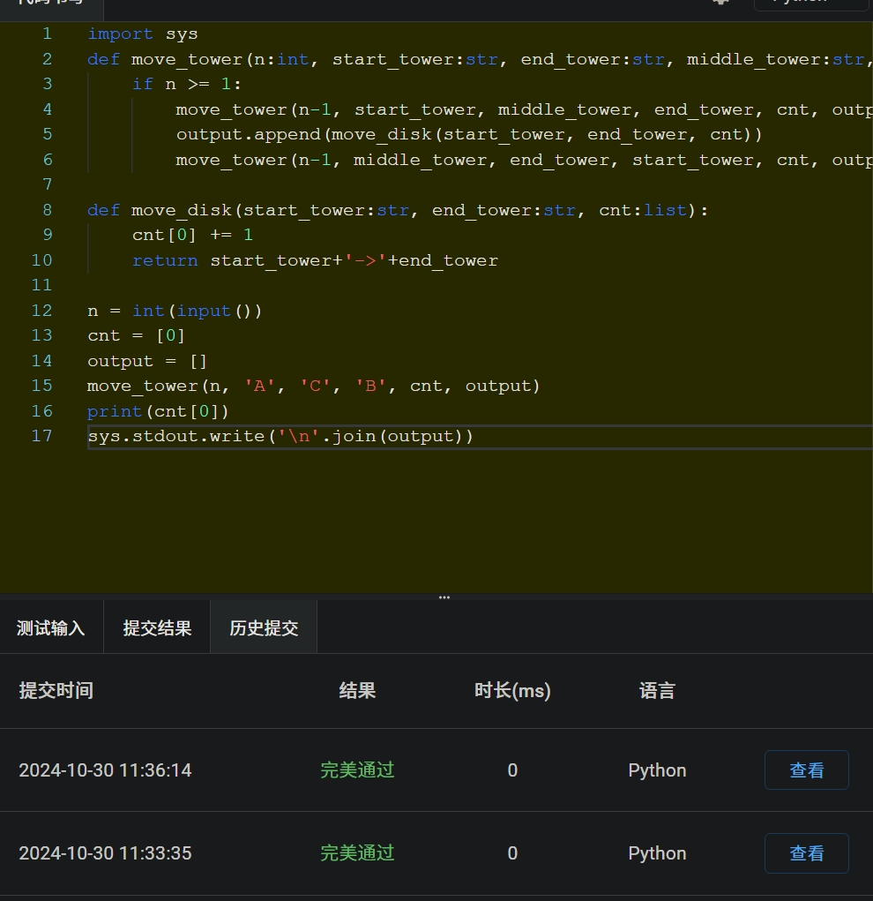
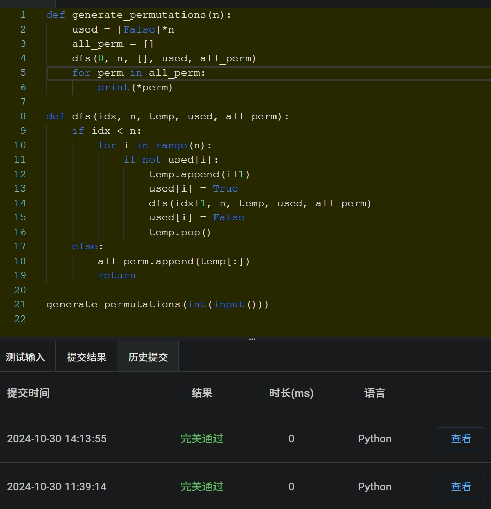
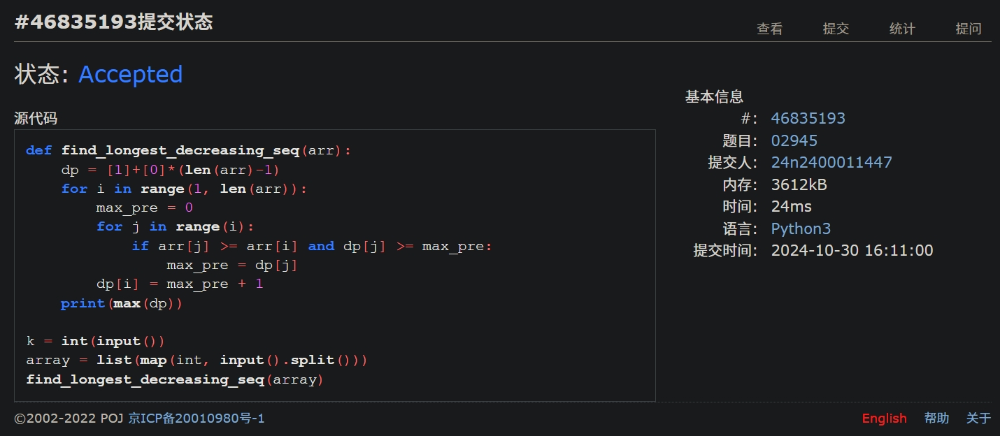
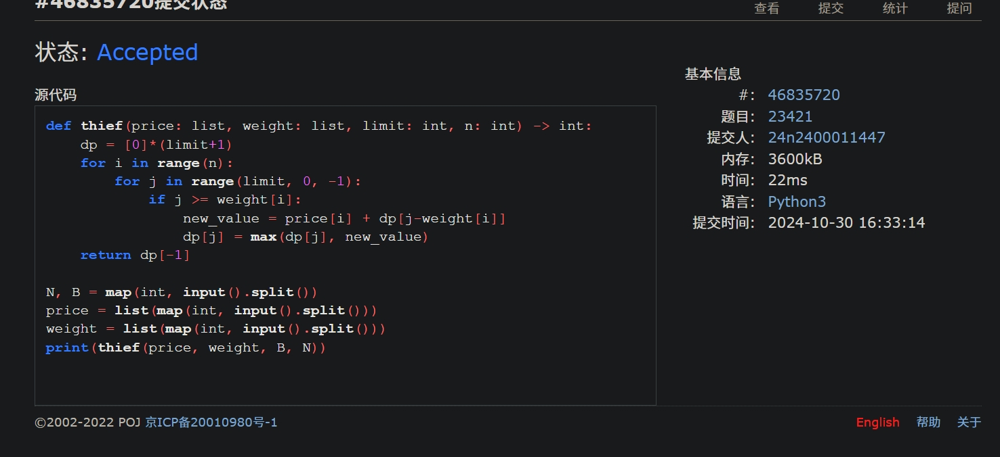
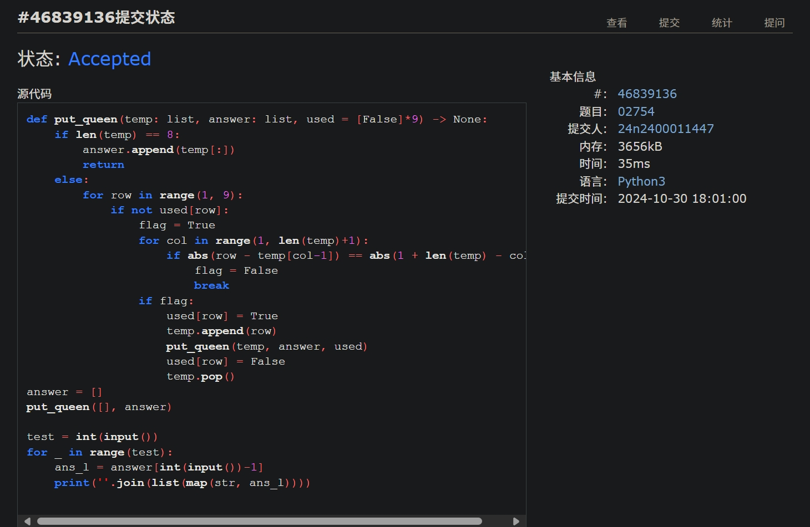
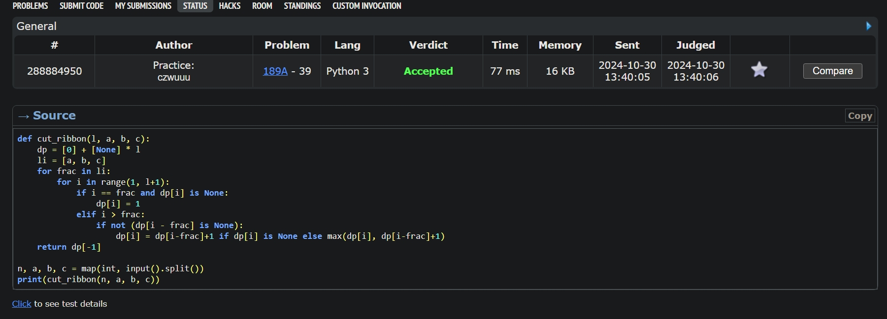

# Assignment #6: Recursion and DP

2024 fall, Complied by <mark>吴诚舟-物理学院</mark>


**说明：**

1）请把每个题目解题思路（可选），源码Python, 或者C++（已经在Codeforces/Openjudge上AC），截图（包含Accepted），填写到下面作业模版中（推荐使用 typora https://typoraio.cn ，或者用word）。AC 或者没有AC，都请标上每个题目大致花费时间。

3）提交时候先提交pdf文件，再把md或者doc文件上传到右侧“作业评论”。Canvas需要有同学清晰头像、提交文件有pdf、"作业评论"区有上传的md或者doc附件。

4）如果不能在截止前提交作业，请写明原因。


## 1. 题目

### sy119: 汉诺塔

recursion, https://sunnywhy.com/sfbj/4/3/119  

代码：

```python
import sys
def move_tower(n:int, start_tower:str, end_tower:str, middle_tower:str, cnt:list, output:list):
    if n >= 1:
        move_tower(n-1, start_tower, middle_tower, end_tower, cnt, output)
        output.append(move_disk(start_tower, end_tower, cnt))
        move_tower(n-1, middle_tower, end_tower, start_tower, cnt, output)

def move_disk(start_tower:str, end_tower:str, cnt:list):
    cnt[0] += 1
    return start_tower+'->'+end_tower

n = int(input())
cnt = [0]
output = []
move_tower(n, 'A', 'C', 'B', cnt, output)
print(cnt[0])
sys.stdout.write('\n'.join(output))
```


代码运行截图 <mark>（至少包含有"Accepted"）</mark>




### sy132: 全排列I

recursion, https://sunnywhy.com/sfbj/4/3/132

思路：

若不给tag最先想到cantor_expansion。没有独立想出如何用递归来解。

1h later: 想到了简洁的递归方法。顺次定下第一个数，对剩下的数仍进行全排列。

代码：

```python
#cantor_expansion
from math import factorial

def cantor_to_permutation(x, n):
    li = [i for i in range(1, n+1)]
    ret = [0]*n
    for j in range(n-1, 0, -1):
        index = x // factorial(j)
        x %= factorial(j)
        ret[n-1-j] = li[index]
        del li[index]
    ret[-1] = li.pop()
    return ret

n = int(input())
for i in range(factorial(n)):
    print(*cantor_to_permutation(i, n))

#recursion
def generate_permutations(n):
    used = [False]*n
    all_perm = []
    dfs(0, n, [], used, all_perm)
    for perm in all_perm:
        print(*perm)

def dfs(idx, n, temp, used, all_perm):
    if idx < n:
        for i in range(n):
            if not used[i]:
                temp.append(i+1)
                used[i] = True
                dfs(idx+1, n, temp, used, all_perm)
                used[i] = False
                temp.pop()
    else:
        all_perm.append(temp[:])
        return

generate_permutations(int(input()))

#my_recursion
def calculate_permutation(num_list):
    if not num_list:
        return [[]]
    else:
        all_perm = []
        for i in range(len(num_list)):
            residue_list = [num_list[j] for j in range(len(num_list)) if j != i]
            all_child_perm = calculate_permutation(residue_list)
            all_ifirst_perm = [[num_list[i]]+all_child_perm[k] for k in range(len(all_child_perm))]
            all_perm.extend(all_ifirst_perm)
        return all_perm

all_perm = calculate_permutation([i+1 for i in range(int(input()))])
for perm in all_perm:
    print(*perm)
```


代码运行截图 ==（至少包含有"Accepted"）==




### 02945: 拦截导弹 

dp, http://cs101.openjudge.cn/2024fallroutine/02945

思路: 第一次做dp，不看答案根本想不出来。关键：分解成无后效性的子问题，状态，值。

Top down: 递归开列表

bottom up:这道题

代码：

```python
def find_longest_decreasing_seq(arr):
    dp = [1]+[0]*(len(arr)-1)
    for i in range(1, len(arr)):
        max_pre = 0
        for j in range(i):
            if arr[j] >= arr[i] and dp[j] >= max_pre:
                max_pre = dp[j]
        dp[i] = max_pre + 1
    print(max(dp))

k = int(input())
array = list(map(int, input().split()))
find_longest_decreasing_seq(array)
```


代码运行截图 <mark>（至少包含有"Accepted"）</mark>




### 23421: 小偷背包 

dp, http://cs101.openjudge.cn/practice/23421

思路：看了算法图解。不看答案的话是一道超难的题啊。

代码：

```python
def thief(price: list, weight: list, limit: int, n: int) -> int:
    dp = [0]*(limit+1)
    for i in range(n):
        for j in range(limit, 0, -1):
            if j >= weight[i]:
                new_value = price[i] + dp[j-weight[i]]
                dp[j] = max(dp[j], new_value)
    return dp[-1]

N, B = map(int, input().split())
price = list(map(int, input().split()))
weight = list(map(int, input().split()))
print(thief(price, weight, B, N))
```


代码运行截图 <mark>（至少包含有"Accepted"）</mark>




### 02754: 八皇后

dfs and similar, http://cs101.openjudge.cn/practice/02754

思路：其实就是全排列，只是添加了额外条件。自己写的代码比较冗长。

代码：

```python
def put_queen(temp: list, answer: list, used = [False]*9) -> None:
    if len(temp) == 8:
        answer.append(temp[:])
        return
    else:
        for row in range(1, 9):
            if not used[row]:
                flag = True
                for col in range(1, len(temp)+1):
                    if abs(row - temp[col-1]) == abs(1 + len(temp) - col):
                        flag = False
                        break
                if flag:
                    used[row] = True
                    temp.append(row)
                    put_queen(temp, answer, used)
                    used[row] = False
                    temp.pop()
answer = []
put_queen([], answer)

test = int(input())
for _ in range(test):
    ans_l = answer[int(input())-1]
    print(''.join(list(map(str, ans_l))))
```


代码运行截图 <mark>（至少包含有"Accepted"）</mark>




### 189A. Cut Ribbon 

brute force, dp 1300 https://codeforces.com/problemset/problem/189/A

思路： 转化为长度为1, 2, ... , n 的彩带如何分割的子问题.类似小偷背包

代码：

```python
def cut_ribbon(l, a, b, c):
    dp = [0] + [None] * l
    li = [a, b, c]
    for frac in li:
        for i in range(1, l+1):
            if i == frac and dp[i] is None:
                dp[i] = 1
            elif i > frac:
                if not (dp[i - frac] is None):
                    dp[i] = dp[i-frac]+1 if dp[i] is None else max(dp[i], dp[i-frac]+1)
    return dp[-1]

n, a, b, c = map(int, input().split())
print(cut_ribbon(n, a, b, c))
```


代码运行截图 <mark>（至少包含有"Accepted"）</mark>




## 2. 学习总结和收获

<mark>如果作业题目简单，有否额外练习题目，比如：OJ“计概2024fall每日选做”、CF、LeetCode、洛谷等网站题目。</mark>

最近比较忙，每日选做没有跟上。（而且题目也比较难）打算之后尽量把POJ上的每日一道做了。

看了一下Binary_indexed_tree和segment_tree。然而还是想不出 排队又来了

recursion和dp都比较难，因为是第一次做，开始几道不看答案几乎做不出，后来慢慢有点感觉。最近涉及较困难的数据结构和算法后，发现最好的方法是把图画出来（树，栈帧，dp的表格），理解起来会容易很多。（怪不得会想到写《算法图解》这本书）

时间没法投入太多的情况下，还是尽量把每道题都吃透吧。加油。

