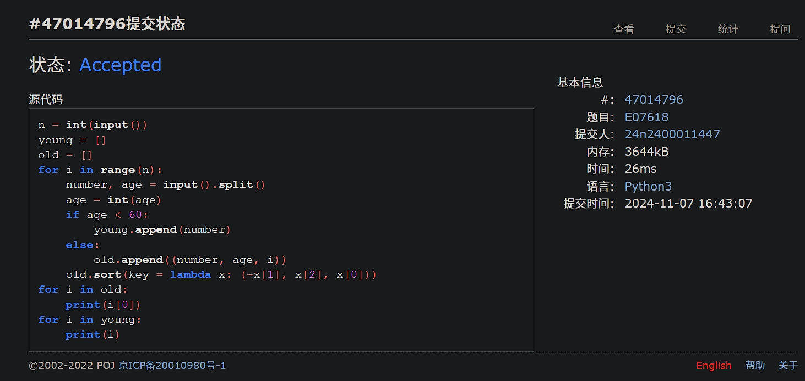
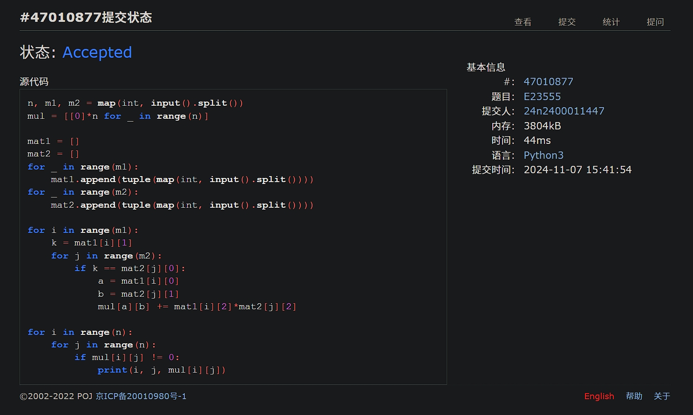
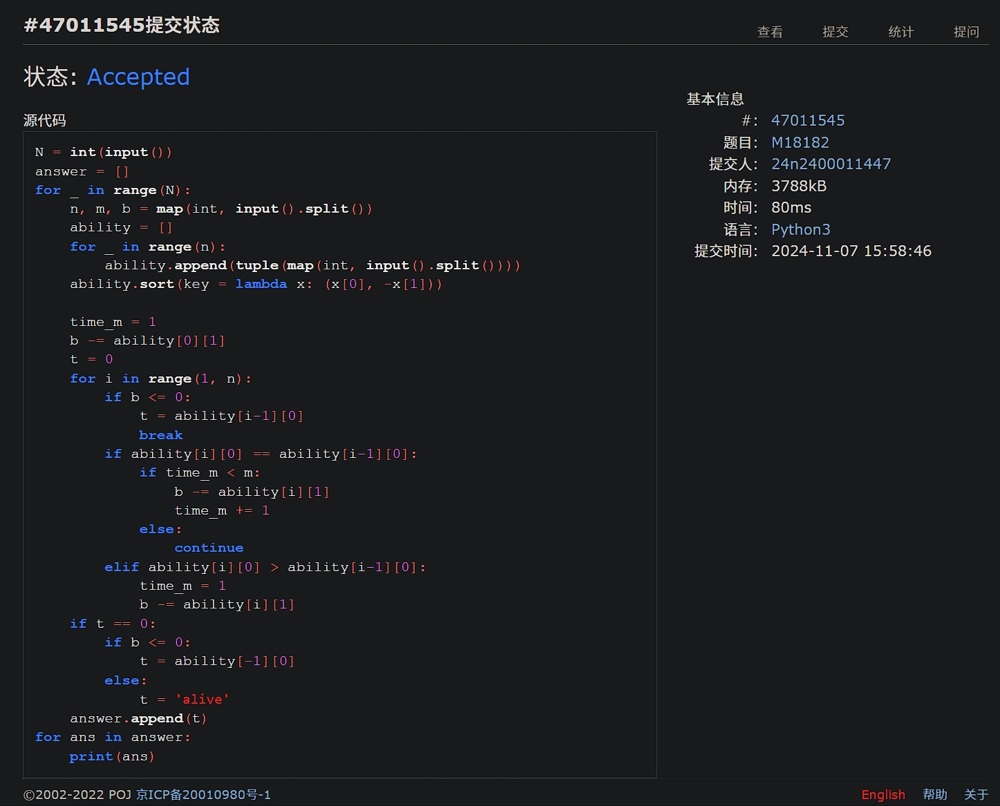
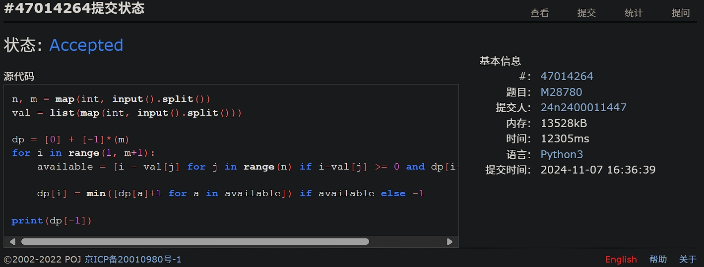
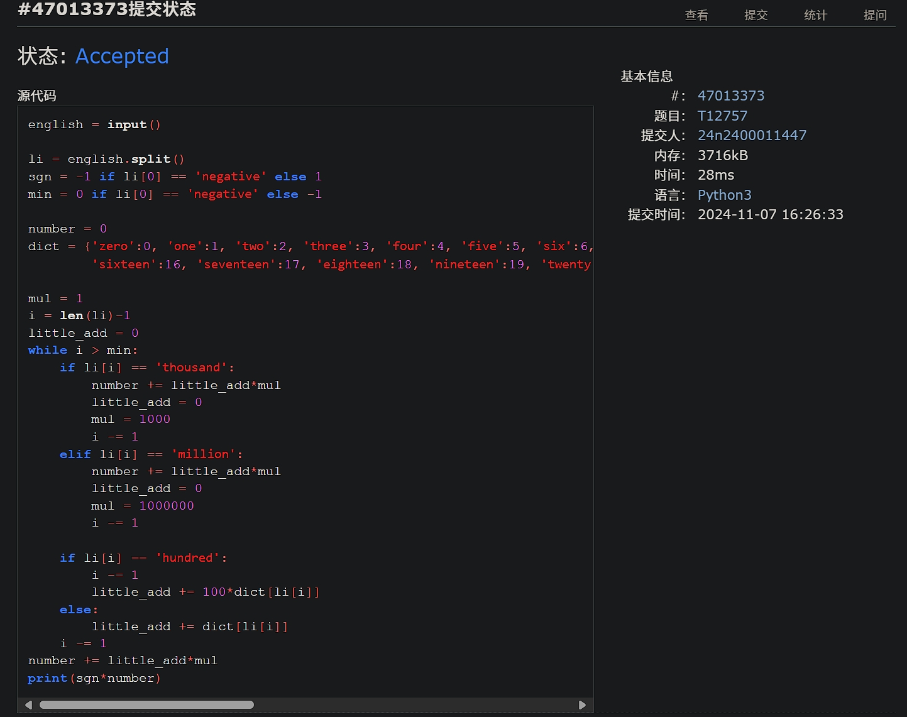
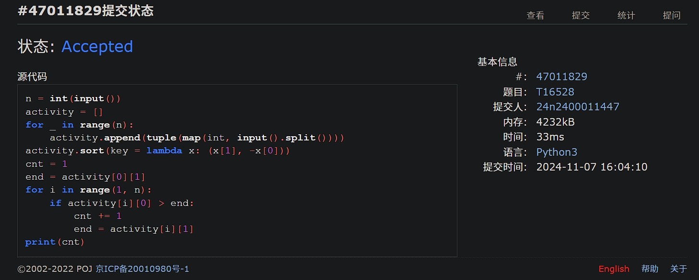

# Assignment #7: Nov Mock Exam立冬

2024 fall, Complied by <mark>吴诚舟-物理学院</mark>


**说明：**

1）⽉考： AC6<mark>（请改为同学的通过数）</mark> 。考试题⽬都在“题库（包括计概、数算题目）”⾥⾯，按照数字题号能找到，可以重新提交。作业中提交⾃⼰最满意版本的代码和截图。

2）请把每个题目解题思路（可选），源码Python, 或者C++（已经在Codeforces/Openjudge上AC），截图（包含Accepted），填写到下面作业模版中（推荐使用 typora https://typoraio.cn ，或者用word）。AC 或者没有AC，都请标上每个题目大致花费时间。

3）提交时候先提交pdf文件，再把md或者doc文件上传到右侧“作业评论”。Canvas需要有同学清晰头像、提交文件有pdf、"作业评论"区有上传的md或者doc附件。

4）如果不能在截止前提交作业，请写明原因。


## 1. 题目

### E07618: 病人排队

sorttings, http://cs101.openjudge.cn/practice/07618/

代码：

```python
n = int(input())
young = []
old = []
for i in range(n):
    number, age = input().split()
    age = int(age)
    if age < 60:
        young.append(number)
    else:
        old.append((number, age, i))
    old.sort(key = lambda x: (-x[1], x[2], x[0]))
for i in old:
    print(i[0])
for i in young:
    print(i)
```


代码运行截图 <mark>（至少包含有"Accepted"）</mark>




### E23555: 节省存储的矩阵乘法

implementation, matrices, http://cs101.openjudge.cn/practice/23555/

代码：

```python
n, m1, m2 = map(int, input().split())
mul = [[0]*n for _ in range(n)]

mat1 = []
mat2 = []
for _ in range(m1):
    mat1.append(tuple(map(int, input().split())))
for _ in range(m2):
    mat2.append(tuple(map(int, input().split())))

for i in range(m1):
    k = mat1[i][1]
    for j in range(m2):
        if k == mat2[j][0]:
            a = mat1[i][0]
            b = mat2[j][1]
            mul[a][b] += mat1[i][2]*mat2[j][2]

for i in range(n):
    for j in range(n):
        if mul[i][j] != 0:
            print(i, j, mul[i][j])
```


代码运行截图 ==（至少包含有"Accepted"）==




### M18182: 打怪兽 

implementation/sortings/data structures, http://cs101.openjudge.cn/practice/18182/

代码：

```python
N = int(input())
answer = []
for _ in range(N):
    n, m, b = map(int, input().split())
    ability = []
    for _ in range(n):
        ability.append(tuple(map(int, input().split())))
    ability.sort(key = lambda x: (x[0], -x[1]))

    time_m = 1
    b -= ability[0][1]
    t = 0
    for i in range(1, n):
        if b <= 0:
            t = ability[i-1][0]
            break
        if ability[i][0] == ability[i-1][0]:
            if time_m < m:
                b -= ability[i][1]
                time_m += 1
            else:
                continue
        elif ability[i][0] > ability[i-1][0]:
            time_m = 1
            b -= ability[i][1]
    if t == 0:
        if b <= 0:
            t = ability[-1][0]
        else:
            t = 'alive'
    answer.append(t)
for ans in answer:
    print(ans)
```


代码运行截图 <mark>（至少包含有"Accepted"）</mark>




### M28780: 零钱兑换3

dp, http://cs101.openjudge.cn/practice/28780/

代码：

```python
n, m = map(int, input().split())
val = list(map(int, input().split()))

dp = [0] + [-1]*(m)
for i in range(1, m+1):
    available = [i - val[j] for j in range(n) if i-val[j] >= 0 and dp[i-val[j]] > -1]

    dp[i] = min([dp[a]+1 for a in available]) if available else -1

print(dp[-1])
```


代码运行截图 <mark>（至少包含有"Accepted"）</mark>




### T12757: 阿尔法星人翻译官

implementation, http://cs101.openjudge.cn/practice/12757

思路：


代码：

```python
english = input()

li = english.split()
sgn = -1 if li[0] == 'negative' else 1
min = 0 if li[0] == 'negative' else -1

number = 0
dict = {'zero':0, 'one':1, 'two':2, 'three':3, 'four':4, 'five':5, 'six':6, 'seven':7, 'eight':8, 'nine':9, 'ten':10, 'eleven':11, 'twelve':12, 'thirteen':13, 'fourteen':14, 'fifteen':15,
        'sixteen':16, 'seventeen':17, 'eighteen':18, 'nineteen':19, 'twenty':20, 'thirty':30, 'forty':40, 'fifty':50, 'sixty':60, 'seventy':70, 'eighty':80, 'ninety':90}

mul = 1
i = len(li)-1
little_add = 0
while i > min:
    if li[i] == 'thousand':
        number += little_add*mul
        little_add = 0
        mul = 1000
        i -= 1
    elif li[i] == 'million':
        number += little_add*mul
        little_add = 0
        mul = 1000000
        i -= 1

    if li[i] == 'hundred':
        i -= 1
        little_add += 100*dict[li[i]]
    else:
        little_add += dict[li[i]]
    i -= 1
number += little_add*mul
print(sgn*number)
```


代码运行截图 <mark>（至少包含有"Accepted"）</mark>




### T16528: 充实的寒假生活

greedy/dp, cs10117 Final Exam, http://cs101.openjudge.cn/practice/16528/

代码：

```python
n = int(input())
activity = []
for _ in range(n):
    activity.append(tuple(map(int, input().split())))
activity.sort(key = lambda x: (x[1], -x[0]))
cnt = 1
end = activity[0][1]
for i in range(1, n):
    if activity[i][0] > end:
        cnt += 1
        end = activity[i][1]
print(cnt)
```


代码运行截图 <mark>（至少包含有"Accepted"）</mark>




## 2. 学习总结和收获

<mark>如果作业题目简单，有否额外练习题目，比如：OJ“计概2024fall每日选做”、CF、LeetCode、洛谷等网站题目。</mark>

每日选做有段时间没做了。

这次考试ak了。然而过程十分曲折。第一道题做了25分钟没想出来，看到旁边ac的人数一直增长真的很慌啊！最后还是放下往后做了。心态有点受影响，导致第二道题做了一会儿。然后看到两道tough居然有人做了，于是看了一下发现还挺简单，于是很快做完（最后一题甚至加上写代码只用了6min），重拾信心（说明这两周在贪心和dp上的训练还是有效的）。最后回头看第一题，终于想通。去掉第一题所浪费的时间，实际只花了1h多一点。

发现自己考试实际上很容易受其他人影响，感觉落后了就会很慌。得尽量稳住心态，冷静思考。

感觉最近期中有点忙，课件还没来得及看。


