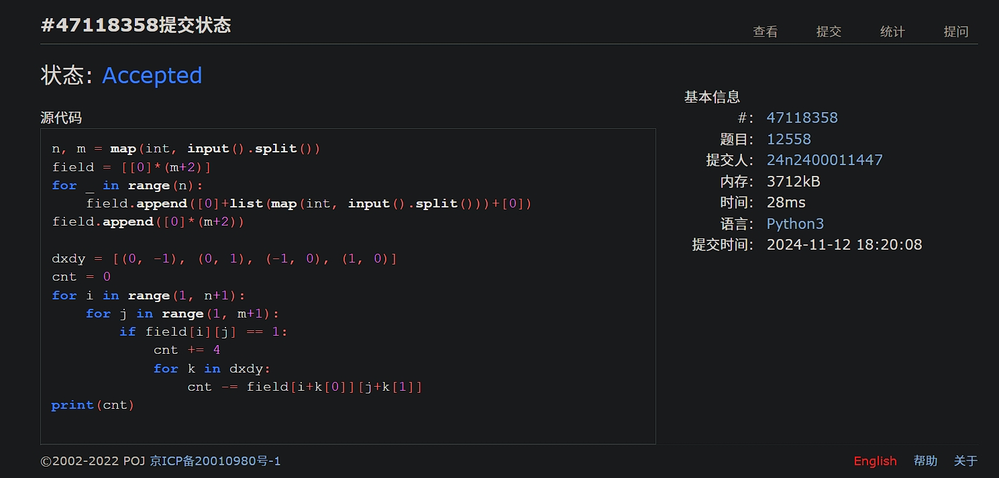
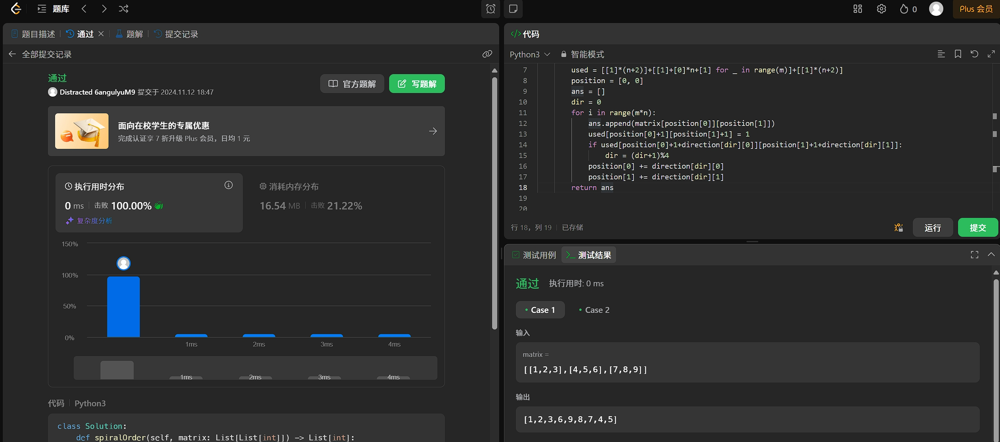
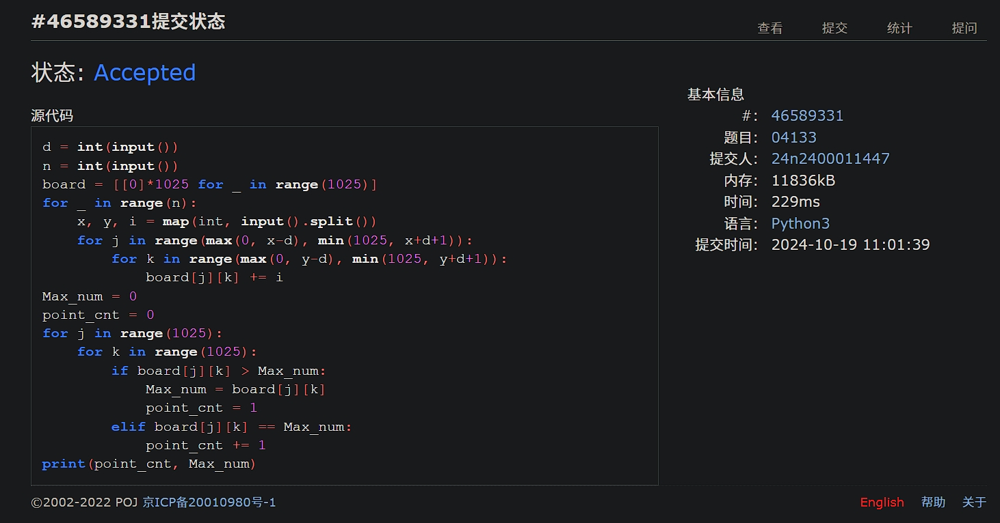
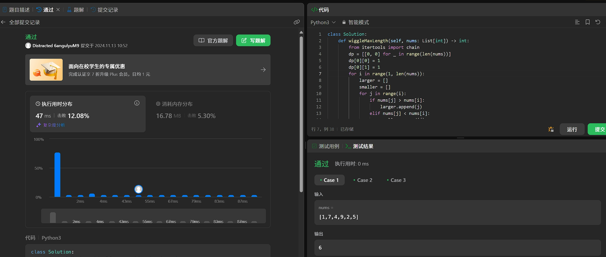
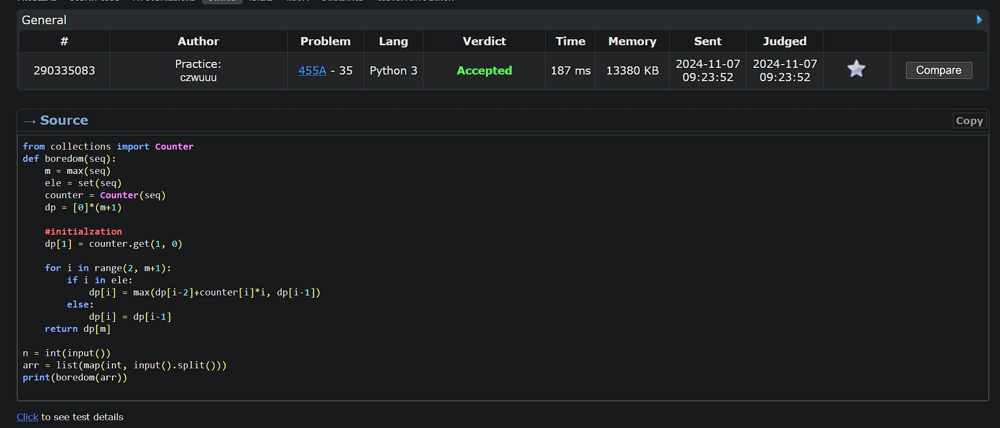
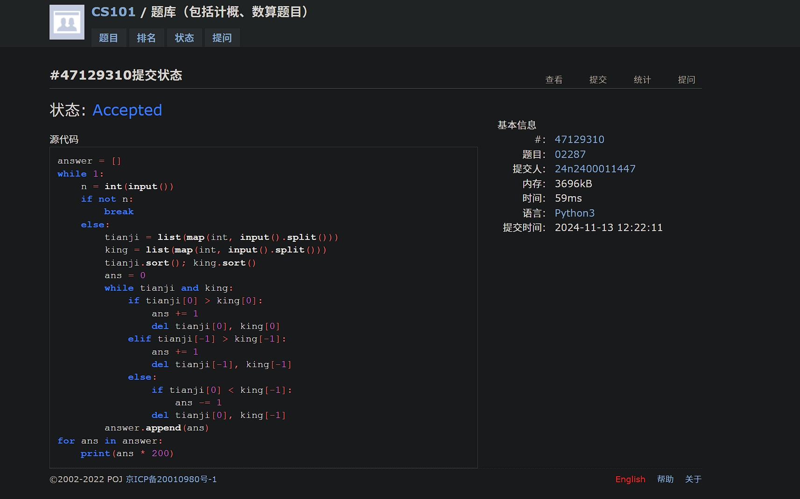

# Assignment #8: 田忌赛马来了

Updated 1021 GMT+8 Nov 12, 2024

2024 fall, Complied by <mark>吴诚舟---物理学院</mark>


**说明：**

1）请把每个题目解题思路（可选），源码Python, 或者C++（已经在Codeforces/Openjudge上AC），截图（包含Accepted），填写到下面作业模版中（推荐使用 typora https://typoraio.cn ，或者用word）。AC 或者没有AC，都请标上每个题目大致花费时间。

2）提交时候先提交pdf文件，再把md或者doc文件上传到右侧“作业评论”。Canvas需要有同学清晰头像、提交文件有pdf、"作业评论"区有上传的md或者doc附件。

3）如果不能在截止前提交作业，请写明原因。


## 1. 题目

### 12558: 岛屿周⻓

matices, http://cs101.openjudge.cn/practice/12558/ 

代码：

```python
n, m = map(int, input().split())
field = [[0]*(m+2)]
for _ in range(n):
    field.append([0]+list(map(int, input().split()))+[0])
field.append([0]*(m+2))

dxdy = [(0, -1), (0, 1), (-1, 0), (1, 0)]
cnt = 0
for i in range(1, n+1):
    for j in range(1, m+1):
        if field[i][j] == 1:
            cnt += 4
            for k in dxdy:
                cnt -= field[i+k[0]][j+k[1]]
print(cnt)
```


代码运行截图 <mark>（至少包含有"Accepted"）</mark>




### LeetCode54.螺旋矩阵

matrice, https://leetcode.cn/problems/spiral-matrix/

与OJ这个题目一样的 18106: 螺旋矩阵，http://cs101.openjudge.cn/practice/18106

代码：

```python
class Solution:
    def spiralOrder(self, matrix: List[List[int]]) -> List[int]:
        i = 0
        j = 0
        m, n = len(matrix), len(matrix[0])
        direction = [(0, 1), (1, 0), (0, -1), (-1, 0)]
        used = [[1]*(n+2)]+[[1]+[0]*n+[1] for _ in range(m)]+[[1]*(n+2)]
        position = [0, 0]
        ans = []
        dir = 0
        for i in range(m*n):
            ans.append(matrix[position[0]][position[1]])
            used[position[0]+1][position[1]+1] = 1
            if used[position[0]+1+direction[dir][0]][position[1]+1+direction[dir][1]]:
                dir = (dir+1)%4
            position[0] += direction[dir][0]
            position[1] += direction[dir][1]
        return ans
```


代码运行截图 ==（至少包含有"Accepted"）==




### 04133:垃圾炸弹

matrices, http://cs101.openjudge.cn/practice/04133/

代码：

```python
d = int(input())
n = int(input())
board = [[0]*1025 for _ in range(1025)]
for _ in range(n):
    x, y, i = map(int, input().split())
    for j in range(max(0, x-d), min(1025, x+d+1)):
        for k in range(max(0, y-d), min(1025, y+d+1)):
            board[j][k] += i
Max_num = 0
point_cnt = 0
for j in range(1025):
    for k in range(1025):
        if board[j][k] > Max_num:
            Max_num = board[j][k]
            point_cnt = 1
        elif board[j][k] == Max_num:
            point_cnt += 1
print(point_cnt, Max_num)
```


代码运行截图 <mark>（至少包含有"Accepted"）</mark>




### LeetCode376.摆动序列

greedy, dp, https://leetcode.cn/problems/wiggle-subsequence/

与OJ这个题目一样的，26976:摆动序列, http://cs101.openjudge.cn/routine/26976/

代码：

```python
class Solution:
    def wiggleMaxLength(self, nums: List[int]) -> int:
        from itertools import chain
        dp = [[0, 0] for _ in range(len(nums))]
        dp[0][0] = 1
        dp[0][1] = 1
        for i in range(1, len(nums)):
            larger = []
            smaller = []
            for j in range(i):
                if nums[j] > nums[i]:
                    larger.append(j)
                elif nums[j] < nums[i]:
                    smaller.append(j)
            if smaller:
                dp[i][0] = max([dp[j][1] for j in smaller])+1
            if larger:
                dp[i][1] = max([dp[j][0] for j in larger])+1
        return max(chain.from_iterable(dp))
```


代码运行截图 <mark>（至少包含有"Accepted"）</mark>




### CF455A: Boredom

dp, 1500, https://codeforces.com/contest/455/problem/A

代码：

```python
from collections import Counter
def boredom(seq):
    m = max(seq)
    ele = set(seq)
    counter = Counter(seq)
    dp = [0]*(m+1)
 
    #initialzation
    dp[1] = counter.get(1, 0)
 
    for i in range(2, m+1):
        if i in ele:
            dp[i] = max(dp[i-2]+counter[i]*i, dp[i-1])
        else:
            dp[i] = dp[i-1]
    return dp[m]
 
n = int(input())
arr = list(map(int, input().split()))
print(boredom(arr))
```


代码运行截图 <mark>（至少包含有"Accepted"）</mark>




### 02287: Tian Ji -- The Horse Racing

greedy, dfs http://cs101.openjudge.cn/practice/02287

代码：

```python
answer = []
while 1:
    n = int(input())
    if not n:
        break
    else:
        tianji = list(map(int, input().split()))
        king = list(map(int, input().split()))
        tianji.sort(); king.sort()
        ans = 0
        while tianji and king:
            if tianji[0] > king[0]:
                ans += 1
                del tianji[0], king[0]
            elif tianji[-1] > king[-1]:
                ans += 1
                del tianji[-1], king[-1]
            else:
                if tianji[0] < king[-1]:
                    ans -= 1
                del tianji[0], king[-1]
        answer.append(ans)
for ans in answer:
    print(ans * 200)
```


代码运行截图 <mark>（至少包含有"Accepted"）</mark>




## 2. 学习总结和收获

<mark>如果作业题目简单，有否额外练习题目，比如：OJ“计概2024fall每日选做”、CF、LeetCode、洛谷等网站题目。</mark>

FIFO---bfs---queue, LIFO---dfs---stack?

