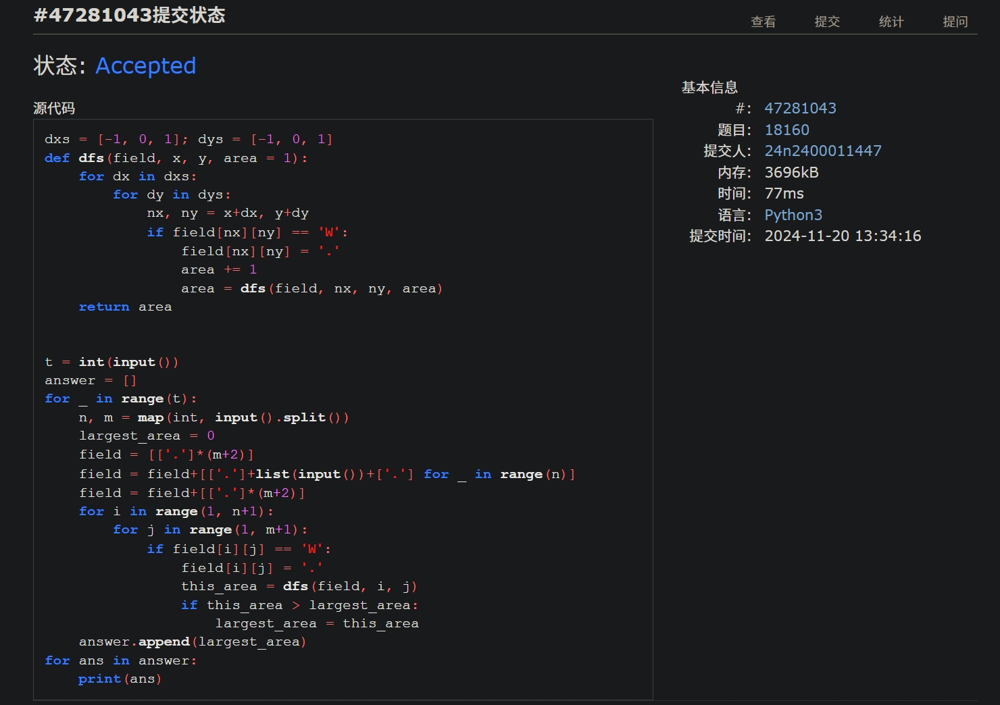
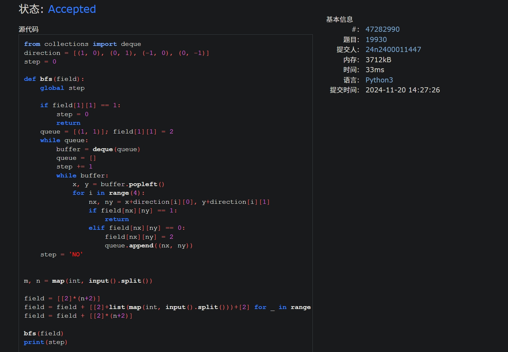
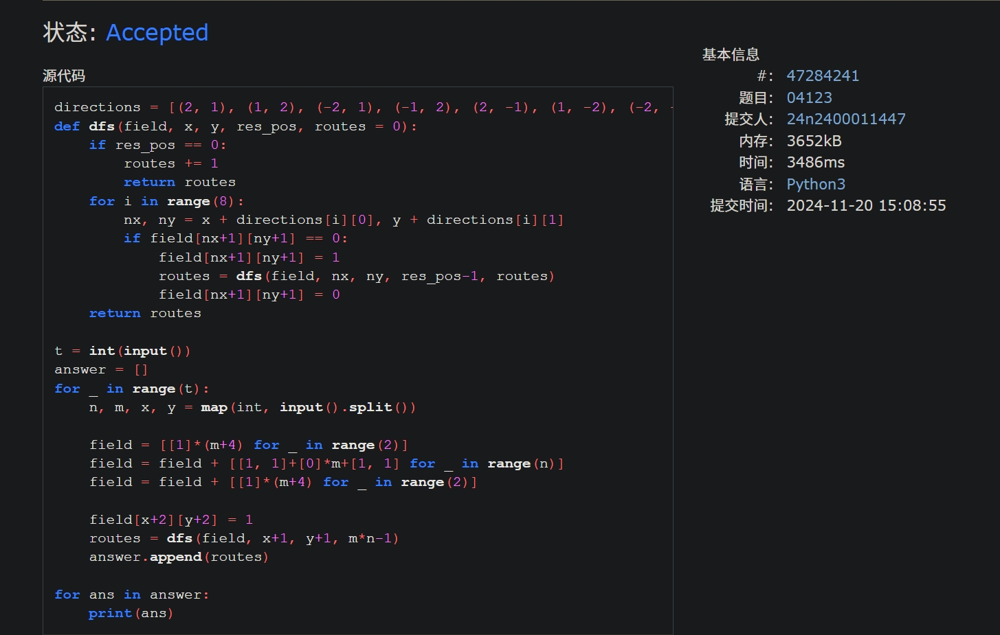
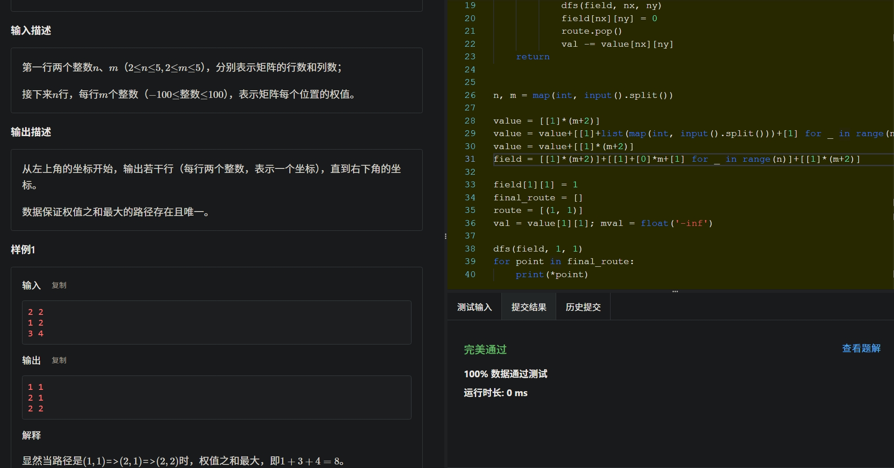
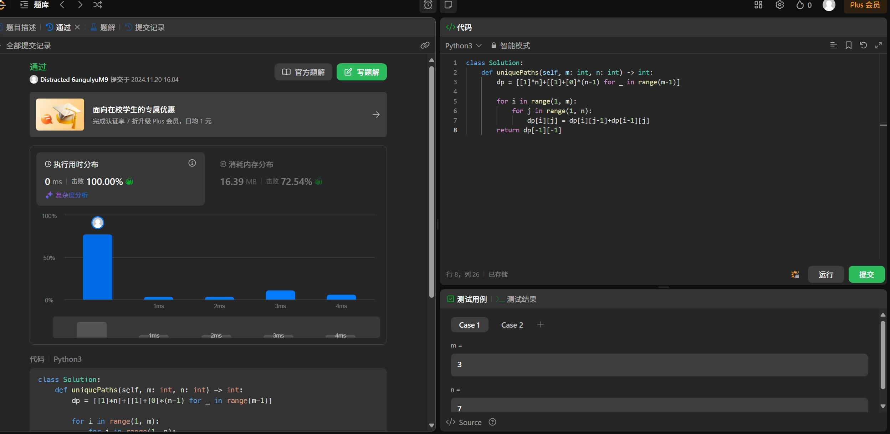
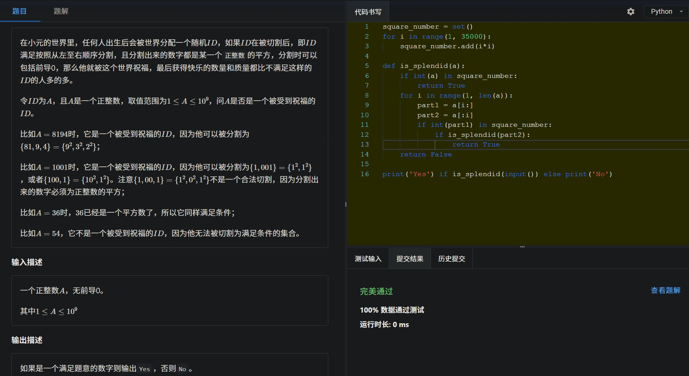

# Assignment #9: dfs, bfs, & dp

2024 fall, Complied by <mark>吴诚舟---物理学院</mark>


**说明：**

1）请把每个题目解题思路（可选），源码Python, 或者C++（已经在Codeforces/Openjudge上AC），截图（包含Accepted），填写到下面作业模版中（推荐使用 typora https://typoraio.cn ，或者用word）。AC 或者没有AC，都请标上每个题目大致花费时间。

2）提交时候先提交pdf文件，再把md或者doc文件上传到右侧“作业评论”。Canvas需要有同学清晰头像、提交文件有pdf、"作业评论"区有上传的md或者doc附件。

3）如果不能在截止前提交作业，请写明原因。


## 1. 题目

### 18160: 最大连通域面积

dfs similar, http://cs101.openjudge.cn/practice/18160

代码：

```python
dxs = [-1, 0, 1]; dys = [-1, 0, 1]
def dfs(field, x, y, area = 1):
    for dx in dxs:
        for dy in dys:
            nx, ny = x+dx, y+dy
            if field[nx][ny] == 'W':
                field[nx][ny] = '.'
                area += 1
                area = dfs(field, nx, ny, area)
    return area

t = int(input())
answer = []
for _ in range(t):
    n, m = map(int, input().split())
    largest_area = 0
    field = [['.']*(m+2)]
    field = field+[['.']+list(input())+['.'] for _ in range(n)]
    field = field+[['.']*(m+2)]
    for i in range(1, n+1):
        for j in range(1, m+1):
            if field[i][j] == 'W':
                field[i][j] = '.'
                this_area = dfs(field, i, j)
                if this_area > largest_area:
                    largest_area = this_area
    answer.append(largest_area)
for ans in answer:
    print(ans)
```


代码运行截图 <mark>（至少包含有"Accepted"）</mark>




### 19930: 寻宝

bfs, http://cs101.openjudge.cn/practice/19930

**调试了很久才考虑到field[1]\[1]==1的坑点**

代码：

```python
from collections import deque
direction = [(1, 0), (0, 1), (-1, 0), (0, -1)]
step = 0

def bfs(field):
    global step

    if field[1][1] == 1:
        step = 0
        return
    queue = [(1, 1)]; field[1][1] = 2
    while queue:
        buffer = deque(queue)
        queue = []
        step += 1
        while buffer:
            x, y = buffer.popleft()
            for i in range(4):
                nx, ny = x+direction[i][0], y+direction[i][1]
                if field[nx][ny] == 1:
                    return
                elif field[nx][ny] == 0:
                    field[nx][ny] = 2
                    queue.append((nx, ny))
    step = 'NO'


m, n = map(int, input().split())

field = [[2]*(n+2)]
field = field + [[2]+list(map(int, input().split()))+[2] for _ in range(m)]
field = field + [[2]*(n+2)]

bfs(field)
print(step)
```


代码运行截图 ==（至少包含有"Accepted"）==




### 04123: 马走日

dfs, http://cs101.openjudge.cn/practice/04123

代码：

```python
directions = [(2, 1), (1, 2), (-2, 1), (-1, 2), (2, -1), (1, -2), (-2, -1), (-1, -2)]
def dfs(field, x, y, res_pos, routes = 0):
    if res_pos == 0:
        routes += 1
        return routes
    for i in range(8):
        nx, ny = x + directions[i][0], y + directions[i][1]
        if field[nx+1][ny+1] == 0:
            field[nx+1][ny+1] = 1
            routes = dfs(field, nx, ny, res_pos-1, routes)
            field[nx+1][ny+1] = 0
    return routes

t = int(input())
answer = []
for _ in range(t):
    n, m, x, y = map(int, input().split())

    field = [[1]*(m+4) for _ in range(2)]
    field = field + [[1, 1]+[0]*m+[1, 1] for _ in range(n)]
    field = field + [[1]*(m+4) for _ in range(2)]

    field[x+2][y+2] = 1
    routes = dfs(field, x+1, y+1, m*n-1)
    answer.append(routes)

for ans in answer:
    print(ans)
```


代码运行截图 <mark>（至少包含有"Accepted"）</mark>




### sy316: 矩阵最大权值路径

dfs, https://sunnywhy.com/sfbj/8/1/316

代码：

```python
direction = [(1, 0), (0, 1), (-1, 0), (0, -1)]

def dfs(field, x, y):
    global val, mval
    global final_route
    for i in range(4):
        nx, ny = x+direction[i][0], y+direction[i][1]
        if nx == n and ny == m:
            route.append((n, m))
            if val + value[n][m] > mval:
                mval = val + value[n][m]
                final_route = route[:]
            route.pop()
            continue
        if field[nx][ny] == 0:
            val += value[nx][ny]
            route.append((nx, ny))
            field[nx][ny] = 1
            dfs(field, nx, ny)
            field[nx][ny] = 0
            route.pop()
            val -= value[nx][ny]
    return

n, m = map(int, input().split())

value = [[1]*(m+2)]
value = value+[[1]+list(map(int, input().split()))+[1] for _ in range(n)]
value = value+[[1]*(m+2)]
field = [[1]*(m+2)]+[[1]+[0]*m+[1] for _ in range(n)]+[[1]*(m+2)]

field[1][1] = 1
final_route = []
route = [(1, 1)]
val = value[1][1]; mval = float('-inf')

dfs(field, 1, 1)
for point in final_route:
    print(*point)
```


代码运行截图 <mark>（至少包含有"Accepted"）</mark>




### LeetCode62.不同路径

dp, https://leetcode.cn/problems/unique-paths/

代码：

```python
class Solution:
    def uniquePaths(self, m: int, n: int) -> int:
        dp = [[1]*n]+[[1]+[0]*(n-1) for _ in range(m-1)]

        for i in range(1, m):
            for j in range(1, n):
                dp[i][j] = dp[i][j-1]+dp[i-1][j]
        return dp[-1][-1]
```


代码运行截图 <mark>（至少包含有"Accepted"）</mark>




### sy358: 受到祝福的平方

dfs, dp, https://sunnywhy.com/sfbj/8/3/539

代码：

```python
square_number = set()
for i in range(1, 35000):
    square_number.add(i*i)

def is_splendid(a):
    if int(a) in square_number:
        return True
    for i in range(1, len(a)):
        part1 = a[i:]
        part2 = a[:i]
        if int(part1) in square_number:
            if is_splendid(part2):
                return True
    return False

print('Yes') if is_splendid(input()) else print('No')
```


代码运行截图 <mark>（至少包含有"Accepted"）</mark>




## 2. 学习总结和收获

<mark>如果作业题目简单，有否额外练习题目，比如：OJ“计概2024fall每日选做”、CF、LeetCode、洛谷等网站题目。</mark>

每日选做在跟进。会写dfs和bfs，但调试仍然要花很长时间（顺利的话20min）。


